# CHƯƠNG 3. PHÂN TÍCH VÀ THIẾT KẾ HỆ THỐNG

Chương 2 đã trả lời câu hỏi *hệ thống phải làm được những gì*, dưới dạng 37 user story, 93 yêu cầu chức năng, 36 yêu cầu phi chức năng và 23 quy tắc nghiệp vụ. Chương này trả lời câu hỏi kế tiếp: **những yêu cầu đó được tổ chức thành hình hài nào để lập trình được**.

Chương gồm ba lớp nội dung, đi từ ngoài vào trong:

| Lớp | Mục | Câu hỏi được trả lời |
|---|---|---|
| **Hành vi nhìn từ ngoài** | 3.1 – 3.4 | Ai dùng hệ thống để làm gì, quy trình diễn ra theo trình tự nào, dữ liệu chảy từ đâu tới đâu |
| **Dữ liệu và vòng đời của nó** | 3.5 – 3.6 | Dữ liệu được lưu thành những thực thể nào, và mỗi đối tượng đi qua những trạng thái nào |
| **Mã nguồn và cách các phần hợp tác** | 3.7 – 3.9 | Mã nguồn chia thành những lớp nào, khi một chức năng chạy thì các thành phần gọi nhau theo thứ tự nào, và toàn bộ được xếp thành những tầng nào |

Mục **3.10** đứng riêng và không thuộc ba lớp trên. Đó là ghi chép về một đợt rà soát: sau khi dựng xong mô hình dữ liệu, nhóm đối chiếu ngược nó với từng quy tắc nghiệp vụ và phát hiện mười lăm vấn đề, trong đó mười vấn đề khiến quy tắc đã đặc tả **không thể thực hiện được**. Mục này ghi lại cả cách tìm ra chúng lẫn cách xử lý.

> **Về công cụ vẽ.** Sơ đồ trong chương được dựng bằng hai công cụ, chia theo một tiêu chí duy nhất: **có ký pháp chuẩn hay không**. Những sơ đồ có ký pháp UML ràng buộc — thực thể quan hệ, lớp, tuần tự — vẽ bằng Mermaid, vì công cụ này dựng đúng ký pháp một cách tự động: kim cương đặc phân biệt với kim cương rỗng, mũi tên nét đứt cho quan hệ hiện thực hoá, khối `alt`/`loop` và thanh hoạt động trên đường đời. Riêng sơ đồ tuần tự của UC-10 có 36 thông điệp với các khối `alt` lồng nhau — vẽ tay là không khả thi. Những sơ đồ mang tính khái niệm, không bị ký pháp nào ràng buộc — kiến trúc, phân rã module — vẽ bằng Excalidraw, vì chúng cần hộp lồng nhau biểu diễn ranh giới và màu mang nghĩa ngữ nghĩa, những thứ Mermaid không có. Mọi sơ đồ đều lưu kèm **mã nguồn** (`.mmd`, `.excalidraw`), đúng quy ước ở mục 2.6.2, để sửa lại về sau mà không phải vẽ lại từ đầu.

---

## 3.1. Biểu đồ Use Case

Do số lượng use case lớn, nhóm tách thành ba biểu đồ theo nhóm tác nhân để bảo đảm tính dễ đọc.

### 3.1.1. Phân hệ quản trị và báo cáo — tác nhân Chủ sở hữu, Quản trị hệ thống

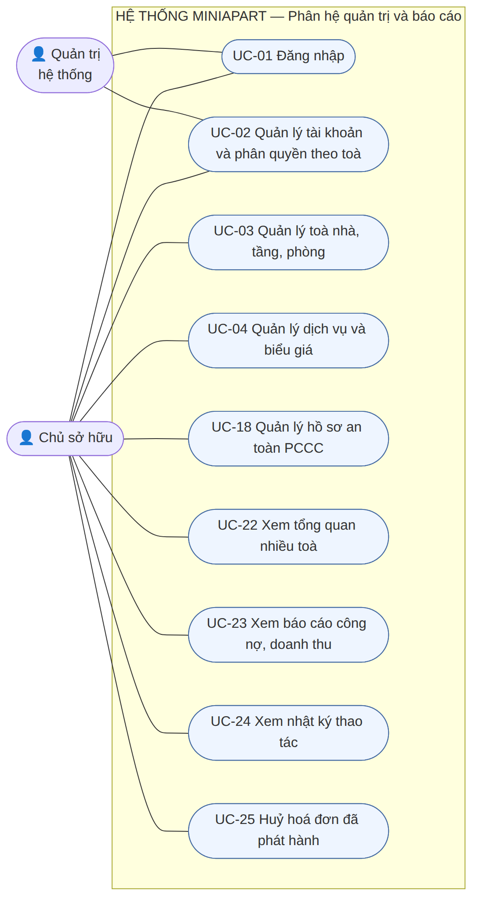

### 3.1.2. Phân hệ vận hành — tác nhân Quản lý toà nhà, Thợ sửa chữa

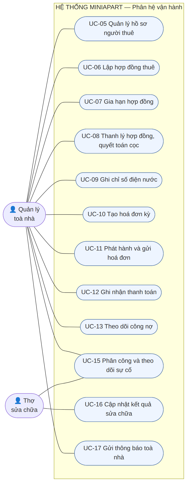

### 3.1.3. Cổng người thuê — tác nhân Người thuê, Người ở cùng

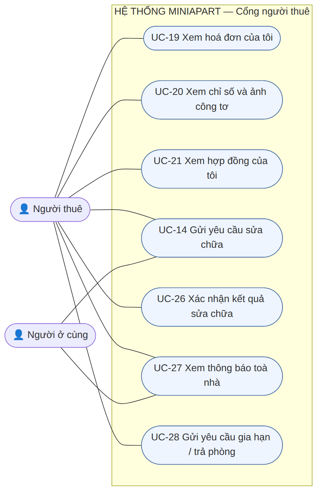

### 3.1.4. Danh sách use case

**Bảng 3.1 — Danh sách use case của hệ thống**

| Mã | Tên use case | Tác nhân chính | US liên quan |
|---|---|---|---|
| UC-01 | Đăng nhập | Mọi vai trò | US-01 |
| UC-02 | Quản lý tài khoản và phân quyền | Chủ sở hữu, Quản trị HT | US-02, US-03 |
| UC-03 | Quản lý toà nhà, tầng, phòng | Chủ sở hữu | US-04, US-05 |
| UC-04 | Quản lý dịch vụ và biểu giá | Chủ sở hữu | US-06 |
| UC-05 | Quản lý hồ sơ người thuê | Quản lý toà nhà | US-08 |
| UC-06 | Lập hợp đồng thuê | Quản lý toà nhà | US-09 |
| UC-07 | Gia hạn hợp đồng | Quản lý toà nhà | US-10 |
| UC-08 | Thanh lý hợp đồng và quyết toán cọc | Quản lý toà nhà | US-11 |
| UC-09 | Ghi chỉ số điện nước | Quản lý toà nhà | US-13, US-14, US-15 |
| UC-10 | Tạo hoá đơn kỳ | Quản lý toà nhà | US-16, US-17 |
| UC-11 | Phát hành và gửi hoá đơn | Quản lý toà nhà | US-18, US-19 |
| UC-12 | Ghi nhận thanh toán | Quản lý toà nhà | US-20, US-21 |
| UC-13 | Theo dõi công nợ | Quản lý toà nhà | US-33 |
| UC-14 | Gửi yêu cầu sửa chữa | Người thuê | US-22 |
| UC-15 | Phân công và theo dõi sự cố | Quản lý toà nhà | US-23 |
| UC-16 | Cập nhật kết quả sửa chữa | Thợ sửa chữa | US-23 |
| UC-17 | Gửi thông báo toà nhà | Quản lý toà nhà | US-26 |
| UC-18 | Quản lý hồ sơ an toàn PCCC | Chủ sở hữu | US-35 |
| UC-19 | Xem hoá đơn của tôi | Người thuê | US-28 |
| UC-20 | Xem chỉ số và ảnh công tơ | Người thuê | US-14, US-29 |
| UC-21 | Xem hợp đồng của tôi | Người thuê | US-30 |
| UC-22 | Xem tổng quan nhiều toà | Chủ sở hữu | US-32 |
| UC-23 | Xem báo cáo công nợ, doanh thu | Chủ sở hữu | US-33, US-34 |
| UC-24 | Xem nhật ký thao tác | Chủ sở hữu | US-37 |
| UC-25 | Huỷ hoá đơn đã phát hành | Chủ sở hữu | US-17 |
| UC-26 | Xác nhận kết quả sửa chữa | Người thuê | US-23 |
| UC-27 | Xem thông báo toà nhà | Người thuê | US-26 |
| UC-28 | Gửi yêu cầu gia hạn / trả phòng | Người thuê | US-31 |

## 3.2. Đặc tả use case chi tiết

Nhóm đặc tả chi tiết bốn use case, chọn theo tiêu chí **độ phức tạp nghiệp vụ** chứ không theo thứ tự mã: UC-09 và UC-10 là hai use case lõi của bài toán, UC-12 chạm tới tiền và công nợ, UC-08 là use case kết hợp nhiều quy tắc nhất trong toàn hệ thống. Hai mươi bốn use case còn lại đã đủ rõ qua user story và tiêu chí chấp nhận ở Chương 2.

> **Quy ước trình bày.** Đặc tả use case là một **biểu mẫu**, không phải bảng dữ liệu, nên các khung trong mục này không được đánh số bảng. Việc đánh số chỉ áp dụng cho bảng liệt kê và bảng tổng hợp.

### UC-09 · Ghi chỉ số điện nước

| Mục | Nội dung |
|---|---|
| **Mã** | UC-09 |
| **Tác nhân chính** | Quản lý toà nhà |
| **Tác nhân phụ** | — |
| **Mô tả** | Quản lý ghi lại chỉ số công tơ điện và đồng hồ nước của tất cả các phòng trong một kỳ, kèm ảnh chụp làm bằng chứng |
| **Điều kiện trước** | Quản lý đã đăng nhập và được gán quyền cho toà nhà; kỳ hiện tại đang ở trạng thái "Đang mở"; các phòng đã có hợp đồng hiệu lực |
| **Điều kiện sau (thành công)** | Chỉ số của các phòng được lưu kèm ảnh; kỳ đủ điều kiện để tạo hoá đơn |
| **Kích hoạt** | Đến ngày chốt số hoặc quản lý chủ động mở màn hình ghi chỉ số |

**Luồng chính**

| # | Tác nhân | Hệ thống |
|---|---|---|
| 1 | Chọn chức năng "Ghi chỉ số" của kỳ hiện tại | Hiển thị danh sách phòng đang thuê, sắp theo tầng và số phòng, mỗi dòng có chỉ số kỳ trước |
| 2 | Nhập chỉ số điện mới cho phòng đầu tiên | Kiểm tra hợp lệ, tính và hiển thị ngay mức tiêu thụ |
| 3 | Chụp/chọn ảnh công tơ | Nén ảnh, gắn vào bản ghi chỉ số |
| 4 | Lặp lại bước 2–3 cho các phòng còn lại | Lưu tạm dữ liệu từng dòng |
| 5 | Bấm "Lưu chỉ số kỳ" | Kiểm tra đã đủ mọi phòng; lưu toàn bộ; ghi người ghi và thời điểm |
| 6 | | Hiển thị thông báo thành công và số phòng đã ghi |

**Luồng thay thế / ngoại lệ**

| Mã | Tình huống | Xử lý |
|---|---|---|
| E1 | Chỉ số mới nhỏ hơn chỉ số kỳ trước | Chặn lưu dòng đó, hiển thị lỗi kèm giá trị kỳ trước, gợi ý chức năng "Thay công tơ" (quay lại bước 2) |
| E2 | Mức tiêu thụ vượt 150% trung bình 3 kỳ | Hiển thị cảnh báo màu vàng, yêu cầu người dùng xác nhận trước khi lưu |
| E3 | Toà bật tuỳ chọn bắt buộc ảnh nhưng thiếu ảnh | Chặn lưu dòng đó, yêu cầu bổ sung ảnh |
| E4 | Còn phòng chưa ghi khi bấm lưu kỳ | Hiển thị danh sách phòng thiếu, cho phép lưu tạm nhưng chưa cho chốt kỳ |
| E5 | Mất kết nối mạng | Giữ dữ liệu trên thiết bị, hiển thị biểu tượng "chờ đồng bộ", tự gửi lại khi có mạng |
| E6 | Kỳ đã chốt và đã phát hành hoá đơn | Khoá màn hình ở chế độ chỉ đọc; chỉ Chủ sở hữu mới mở khoá được và thao tác bị ghi nhật ký |

**Quy tắc nghiệp vụ áp dụng:** BR-01, BR-02, BR-09
**Yêu cầu phi chức năng liên quan:** NFR-USA-02, NFR-PER-05, NFR-REL-05

---

### UC-10 · Tạo hoá đơn kỳ

| Mục | Nội dung |
|---|---|
| **Mã** | UC-10 |
| **Tác nhân chính** | Quản lý toà nhà |
| **Mô tả** | Hệ thống tự tính và tạo hoá đơn nháp cho toàn bộ phòng có hợp đồng hiệu lực trong kỳ |
| **Điều kiện trước** | Đã ghi đủ chỉ số dịch vụ theo chỉ số cho các phòng; các hợp đồng đã khai báo đủ dịch vụ và đơn giá |
| **Điều kiện sau** | Mỗi phòng đủ điều kiện có đúng một hoá đơn ở trạng thái Nháp |
| **Kích hoạt** | Quản lý bấm "Tạo hoá đơn kỳ" |

**Luồng chính**

| # | Tác nhân | Hệ thống |
|---|---|---|
| 1 | Chọn kỳ và bấm "Tạo hoá đơn" | Lấy danh sách hợp đồng hiệu lực trong kỳ |
| 2 | | Với mỗi hợp đồng: xác định số ngày ở thực tế trong kỳ (BR-06) |
| 3 | | Tính tiền phòng, tiền dịch vụ theo chỉ số (BR-02, BR-03), phí cố định (BR-04), phí gửi xe (BR-05) |
| 4 | | Cộng các khoản phát sinh đang chờ (ví dụ chi phí sửa chữa do người thuê chịu) |
| 5 | | Trừ số dư khả dụng của phòng (BR-13), làm tròn (BR-15) |
| 6 | | Ghi hoá đơn trạng thái Nháp kèm toàn bộ dòng chi tiết và đơn giá đã áp dụng |
| 7 | | Hiển thị bảng tổng hợp: số hoá đơn tạo được, tổng tiền, danh sách phòng bị bỏ qua kèm lý do |

**Luồng ngoại lệ**

| Mã | Tình huống | Xử lý |
|---|---|---|
| E1 | Phòng chưa có chỉ số của dịch vụ tính theo chỉ số | Bỏ qua phòng đó, ghi lý do "Chưa ghi chỉ số", vẫn tạo cho các phòng khác |
| E2 | Phòng đã có hoá đơn trong kỳ | Bỏ qua, ghi lý do "Đã tồn tại hoá đơn" |
| E3 | Hợp đồng thiếu khai báo đơn giá cho một dịch vụ | Bỏ qua phòng, ghi lý do và chỉ rõ dịch vụ thiếu giá |
| E4 | Lỗi trong quá trình tính | Huỷ toàn bộ thay đổi của riêng phòng đó (không để lại hoá đơn dở dang), ghi log lỗi và tiếp tục phòng tiếp theo |

**Quy tắc nghiệp vụ áp dụng:** BR-01 → BR-07, BR-13, BR-15
**Yêu cầu phi chức năng:** NFR-PER-02, NFR-REL-04

---

### UC-12 · Ghi nhận thanh toán

| Mục | Nội dung |
|---|---|
| **Mã** | UC-12 |
| **Tác nhân chính** | Quản lý toà nhà |
| **Mô tả** | Ghi nhận một lần thu tiền của người thuê cho một hoá đơn, cập nhật công nợ |
| **Điều kiện trước** | Hoá đơn đã phát hành và chưa được thanh toán đủ |
| **Điều kiện sau** | Trạng thái hoá đơn và công nợ được cập nhật; biên lai được sinh |

**Luồng chính**

| # | Tác nhân | Hệ thống |
|---|---|---|
| 1 | Mở hoá đơn cần ghi nhận | Hiển thị số phải thu, đã thu, còn lại |
| 2 | Nhập số tiền, hình thức, ngày thu, ghi chú | Kiểm tra số tiền > 0 |
| 3 | Xác nhận | Ghi bản ghi thanh toán, cộng dồn vào "đã thu" |
| 4 | | Cập nhật trạng thái theo BR-08; nếu thừa thì tạo số dư khả dụng theo BR-13 |
| 5 | | Sinh biên lai có mã, hiển thị trên cổng người thuê; ghi nhật ký |

**Luồng ngoại lệ**

| Mã | Tình huống | Xử lý |
|---|---|---|
| E1 | Số tiền ≤ 0 | Báo lỗi, không lưu |
| E2 | Hoá đơn đã ở trạng thái Đã thanh toán | Cảnh báo "Hoá đơn đã thanh toán đủ", yêu cầu xác nhận nếu vẫn muốn ghi nhận (sẽ thành số dư) |
| E3 | Người dùng muốn sửa/xoá bản ghi đã lưu | Từ chối; hướng dẫn lập bút toán điều chỉnh có lý do (BR-18) |

**Quy tắc nghiệp vụ:** BR-08, BR-12, BR-13, BR-18

---

### UC-08 · Thanh lý hợp đồng và quyết toán cọc

| Mục | Nội dung |
|---|---|
| **Mã** | UC-08 |
| **Tác nhân chính** | Quản lý toà nhà |
| **Tác nhân phụ** | Người thuê (có mặt bàn giao) |
| **Mô tả** | Thực hiện thủ tục trả phòng: chốt chỉ số cuối, kiểm kê tài sản, tính hoá đơn kỳ cuối, quyết toán tiền cọc |
| **Điều kiện trước** | Hợp đồng đang hiệu lực; có yêu cầu trả phòng |
| **Điều kiện sau** | Hợp đồng chuyển trạng thái "Đã thanh lý"; phòng chuyển về "Trống"; công nợ được xử lý dứt điểm |

**Luồng chính**

| # | Tác nhân | Hệ thống |
|---|---|---|
| 1 | Chọn hợp đồng, bấm "Trả phòng" | Kiểm tra thời gian báo trước theo hợp đồng, cảnh báo nếu không đủ |
| 2 | Nhập ngày bàn giao, chỉ số điện nước cuối, ảnh công tơ | Kiểm tra hợp lệ (BR-09) |
| 3 | Đối chiếu tài sản đã bàn giao, ghi hư hỏng và số tiền khấu trừ | Lưu biên bản kiểm kê |
| 4 | Bấm "Tính quyết toán" | Tính hoá đơn kỳ cuối theo BR-06; tính `Tiền cọc - Công nợ - Khấu trừ` (BR-07) |
| 5 | | Hiển thị bảng quyết toán rõ ràng từng dòng |
| 6 | Xác nhận chi trả hoặc thu thêm | Ghi phiếu chi/phiếu thu; chuyển trạng thái hợp đồng và phòng |

**Luồng ngoại lệ**

| Mã | Tình huống | Xử lý |
|---|---|---|
| E1 | Kết quả quyết toán âm (người thuê còn nợ) | Tạo khoản phải thu bổ sung; **không cho** đóng hợp đồng cho tới khi đánh dấu đã xử lý |
| E2 | Còn hoá đơn kỳ trước chưa thanh toán | Đưa vào phần công nợ của bảng quyết toán |
| E3 | Còn yêu cầu sửa chữa đang mở của phòng | Cảnh báo, cho phép tiếp tục nhưng ghi chú vào biên bản |

**Quy tắc nghiệp vụ:** BR-06, BR-07, BR-09, BR-11

## 3.3. Biểu đồ hoạt động (Activity Diagram)

### 3.3.1. Quy trình ghi chỉ số dịch vụ

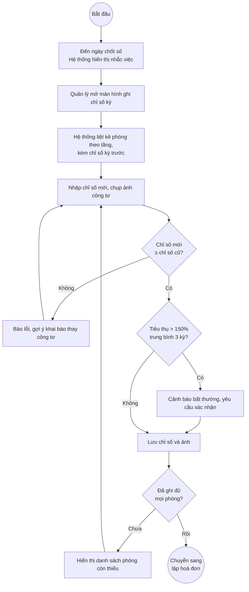

### 3.3.2. Quy trình lập và phát hành hoá đơn

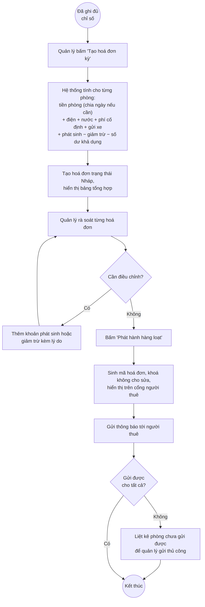

### 3.3.3. Quy trình tiếp nhận yêu cầu sửa chữa

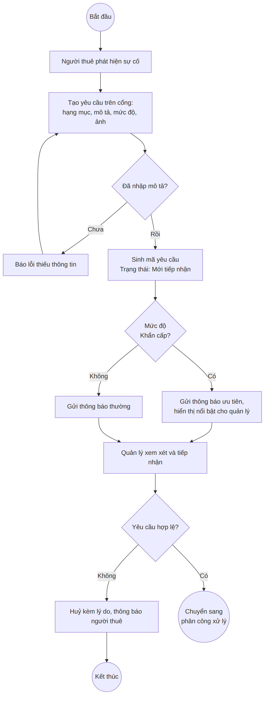

### 3.3.4. Quy trình xử lý và đóng yêu cầu sửa chữa

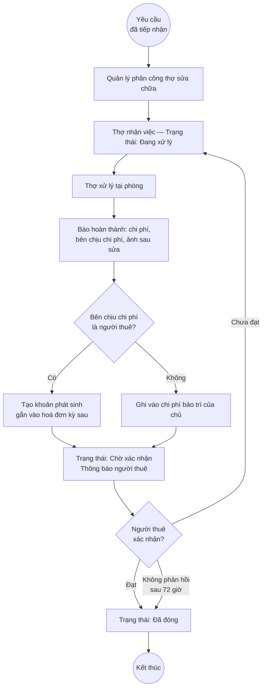

### 3.3.5. Quy trình bàn giao khi trả phòng

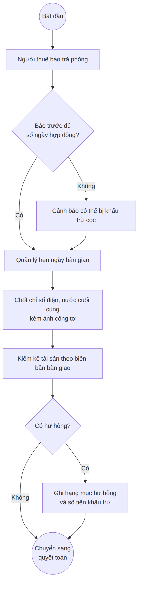

### 3.3.6. Quy trình quyết toán tiền cọc và thanh lý hợp đồng

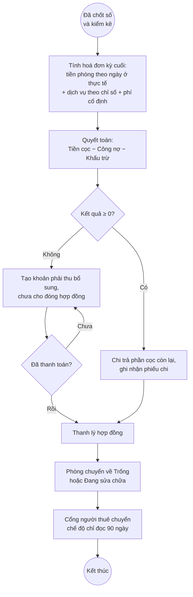

## 3.4. Biểu đồ luồng dữ liệu (DFD)

**Vì sao dùng cả hai hướng mô hình hoá.** Chương này dùng đồng thời biểu đồ luồng dữ liệu — thuộc hướng **phân tích có cấu trúc** — và biểu đồ use case, sơ đồ lớp, sơ đồ tuần tự — thuộc hướng **phân tích hướng đối tượng**. Đây là lựa chọn có chủ đích, không phải trộn lẫn tuỳ tiện, và nhóm phân vai rõ giữa hai hướng:

- **Biểu đồ luồng dữ liệu dùng ở mức tổng quan**, để trả lời câu hỏi *dữ liệu đi vào hệ thống từ đâu, đi ra cho ai, và đọng lại ở những kho nào*. Ở mức này, cách nhìn theo dòng dữ liệu cho bức tranh gọn hơn hẳn: một sơ đồ ngữ cảnh duy nhất đủ để thấy toàn bộ ranh giới hệ thống với bên ngoài — thứ mà biểu đồ use case không diễn đạt trực tiếp được vì nó mô tả *hành vi*, không mô tả *dòng dữ liệu*.
- **Các sơ đồ hướng đối tượng dùng cho thiết kế chi tiết**, vì sản phẩm sẽ được cài đặt bằng Java và React — hai ngôn ngữ hướng đối tượng. Sơ đồ lớp ánh xạ gần như một-đối-một sang mã nguồn, còn sơ đồ tuần tự ánh xạ sang lời gọi giữa các thành phần.

Nói ngắn gọn: **luồng dữ liệu để hiểu bài toán, hướng đối tượng để dựng lời giải.** Điểm nối giữa hai hướng là mục 3.4.2 — chín kho dữ liệu D1–D9 của biểu đồ luồng dữ liệu được ánh xạ thẳng sang các thực thể của mô hình dữ liệu ở mục 3.5, nên hai hướng không nói ngược nhau ở bất kỳ chỗ nào.

### 3.4.1. DFD mức 0 — Sơ đồ ngữ cảnh

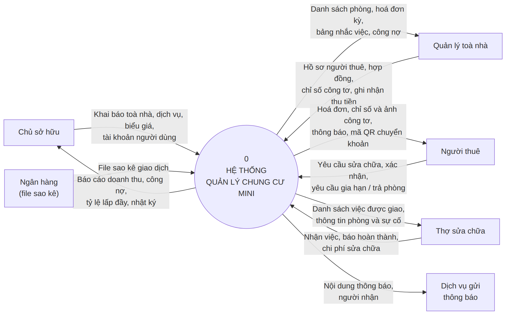

### 3.4.2. DFD mức 1 — Phân rã tiến trình

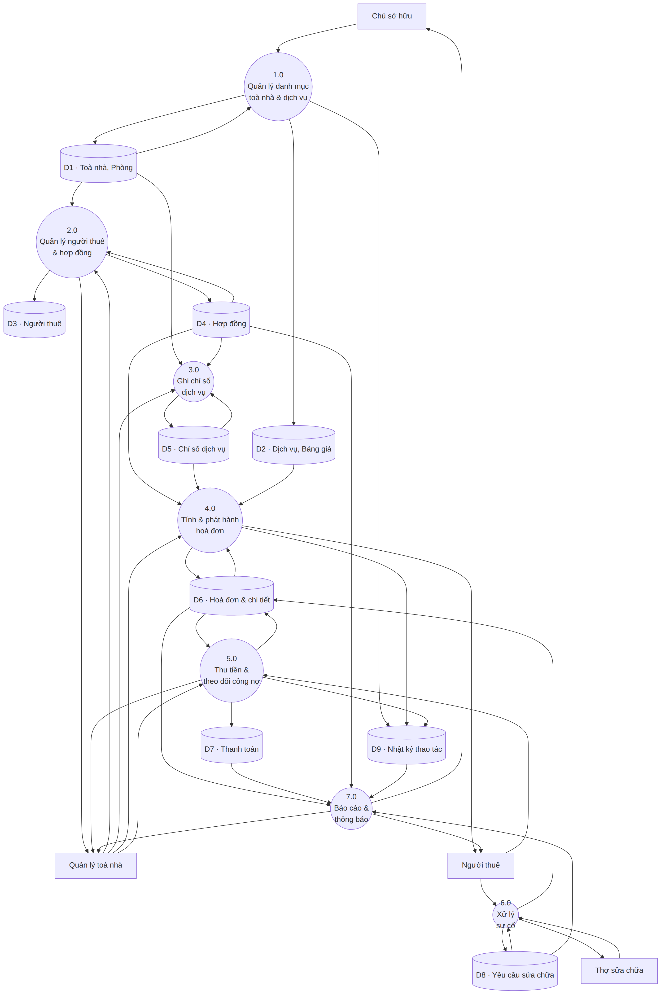

**Bảng 3.2 — Danh sách tiến trình mức 1**

| Mã | Tiến trình | Đầu vào chính | Đầu ra chính |
|---|---|---|---|
| 1.0 | Quản lý danh mục toà nhà và dịch vụ | Thông tin toà, phòng, dịch vụ, biểu giá | Danh mục đã chuẩn hoá lưu vào D1, D2 |
| 2.0 | Quản lý người thuê và hợp đồng | Hồ sơ người thuê, điều khoản hợp đồng | Hợp đồng hiệu lực (D4), trạng thái phòng |
| 3.0 | Ghi chỉ số dịch vụ | Chỉ số công tơ, ảnh | Bản ghi chỉ số hợp lệ (D5) |
| 4.0 | Tính và phát hành hoá đơn | D2, D4, D5 | Hoá đơn và chi tiết (D6), thông báo cho người thuê |
| 5.0 | Thu tiền và theo dõi công nợ | Thông tin thu tiền, file sao kê | Bản ghi thanh toán (D7), trạng thái hoá đơn |
| 6.0 | Xử lý sự cố | Yêu cầu sửa chữa, kết quả xử lý | Bản ghi sự cố (D8), khoản phát sinh vào D6 |
| 7.0 | Báo cáo và thông báo | D4, D6, D7, D8, D9 | Bảng tổng quan, báo cáo, thông báo |

**Bảng 3.3 — Danh sách kho dữ liệu**

| Mã | Kho dữ liệu | Thực thể chính |
|---|---|---|
| D1 | Toà nhà, Phòng | `TOA_NHA`, `PHONG`, `TAI_SAN_PHONG` |
| D2 | Dịch vụ, Bảng giá | `DICH_VU`, `BANG_GIA` |
| D3 | Người thuê | `NGUOI_THUE`, `NGUOI_O_CUNG` |
| D4 | Hợp đồng | `HOP_DONG`, `HOP_DONG_DICH_VU`, `PHUONG_TIEN` |
| D5 | Chỉ số dịch vụ | `KY_THANH_TOAN`, `CHI_SO_DICH_VU` |
| D6 | Hoá đơn | `HOA_DON`, `CHI_TIET_HOA_DON` |
| D7 | Thanh toán | `THANH_TOAN` |
| D8 | Yêu cầu sửa chữa | `YEU_CAU_SUA_CHUA`, `ANH_DINH_KEM` |
| D9 | Nhật ký thao tác | `NHAT_KY_THAO_TAC` |

## 3.5. Biểu đồ thực thể quan hệ (ERD)

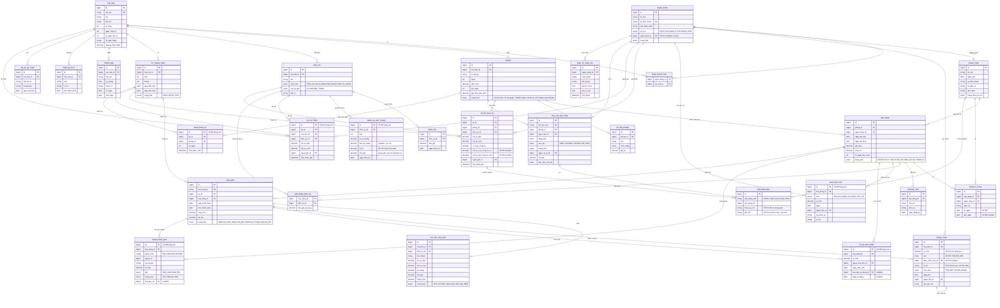

> Ảnh trong tài liệu bị thu nhỏ cho vừa khổ giấy. Bản độ phân giải cao nằm ở `diagrams-v2/07-erd-v2.png`; mã nguồn sơ đồ ở `diagrams-v2/07-erd-v2.mmd` để sửa lại khi cần.
>
> **Đây là phiên bản 2 của mô hình dữ liệu**, đã áp dụng lô phiếu thay đổi số 01. So với phiên bản 1.0, mô hình bổ sung sáu bảng — `NHAN_KHAU_KY`, `BANG_GIA_BAC_THANG`, `CHI_SO_TONG`, `SO_DU_KHA_DUNG`, `GIAO_DICH_COC`, `KHOAN_PHAT_SINH` — và sửa sáu bảng cũ. Mỗi thay đổi được đánh dấu bằng chú thích mã phiếu ngay trong mã nguồn sơ đồ. Sơ đồ phiên bản 1.0 giữ lại ở `diagrams/07-erd.png` để đối chiếu. Lý do của từng thay đổi được trình bày ở **mục 3.10** và trong phụ lục lô phiếu thay đổi số 01.

**Bảng 3.4 — Mô tả các thực thể chính trong mô hình dữ liệu**

| Thực thể | Ý nghĩa | Ghi chú thiết kế |
|---|---|---|
| `TOA_NHA` | Một toà chung cư mini | Mọi bảng nghiệp vụ đều truy về được toà nhà — nền tảng cho phân quyền theo toà và cho việc mở rộng đa chủ sở hữu sau này (NFR-MNT-03) |
| `PHONG` | Một phòng cho thuê | Trạng thái được suy ra từ hợp đồng (BR-11), không sửa tay |
| `NGUOI_THUE` | Cá nhân thuê hoặc ở cùng | Tách khỏi `NGUOI_DUNG` vì không phải người thuê nào cũng có tài khoản đăng nhập. **Phiếu CR-001** bổ sung khoá ngoại nối hai bảng — thiếu liên kết này thì cổng người thuê không xác định được tài khoản đăng nhập ứng với người thuê nào |
| `NGUOI_O_CUNG` / `NHAN_KHAU_KY` | Người ở cùng theo khoảng thời gian, và số người ở đã chốt của từng phòng từng kỳ | **Phiếu CR-002.** `NGUOI_O_CUNG` có `tu_ngay`/`den_ngay` là nguồn sự thật; `NHAN_KHAU_KY` là bản kết tinh bất biến ghi khi chốt kỳ, bảo đảm hoá đơn cũ in lại ra đúng số cũ (NFR-CMP-02) |
| `BANG_GIA_BAC_THANG` | Các bậc của biểu giá điện, kèm ngày hiệu lực | **Phiếu CR-003.** Mỗi bậc một dòng, nên chứa được số bậc bất kỳ — cơ cấu đổi từ 6 bậc sang 5 bậc không phải sửa cấu trúc bảng |
| `SO_DU_KHA_DUNG` | Tiền người thuê trả thừa, chờ trừ vào kỳ sau | **Phiếu CR-006.** Dạng nhiều dòng thay vì một trường số dư, để mỗi khoản truy được về hoá đơn sinh ra nó và hoá đơn tiêu nó |
| `GIAO_DICH_COC` | Thu, hoàn, khấu trừ tiền cọc | **Phiếu CR-009.** `HOP_DONG.tien_coc` chỉ là số tiền thoả thuận, không phải bản ghi đã thu hay chưa |
| `KHOAN_PHAT_SINH` | Khoản chờ tính vào hoá đơn kỳ sau | **Phiếu CR-008.** Có trạng thái `Chờ tính`/`Đã tính` và khoá ngoại tới hoá đơn đã tiêu nó — **ngăn việc thu tiền lặp lại mỗi kỳ** cho một lần sửa chữa duy nhất |
| `HOP_DONG` | Thoả thuận thuê một phòng trong một khoảng thời gian | Ràng buộc: không chồng lấn thời gian trên cùng phòng (BR-10) |
| `HOP_DONG_DICH_VU` | Đơn giá dịch vụ **chốt tại thời điểm ký** | Cho phép mỗi hợp đồng có giá riêng, tách khỏi bảng giá chung |
| `KY_THANH_TOAN` | Một kỳ tính phí của một toà | Là "mốc neo" để nhóm chỉ số và hoá đơn; có trạng thái Đang mở / Đã chốt |
| `CHI_SO_DICH_VU` | Chỉ số công tơ của một phòng, một dịch vụ, một kỳ | Khoá duy nhất: (kỳ, phòng, dịch vụ). **Phiếu CR-004** bổ sung hai trường `chi_so_cuoi_cong_to_cu` và `chi_so_dau_cong_to_moi` — công thức BR-09 cần đủ bốn chỉ số, riêng cờ `co_thay_cong_to` không đủ dữ liệu để tính |
| `HOA_DON` / `CHI_TIET_HOA_DON` | Hoá đơn kỳ và các dòng khoản mục | Chi tiết lưu **đơn giá đã áp dụng** để hoá đơn cũ không bị thay đổi khi tăng giá (FR-BLD-06) |
| `THANH_TOAN` | Một lần thu tiền | Nhiều bản ghi cho một hoá đơn → hỗ trợ thu nhiều lần; không xoá (BR-18). **Phiếu CR-010** bổ sung `loai`, `dieu_chinh_cho_id`, `ly_do` để lập bút toán đối ứng. Bút toán đối ứng mang **số tiền âm**, nên trường số tiền không đặt ràng buộc phải dương |
| `YEU_CAU_SUA_CHUA` | Một sự cố được báo | Có vòng đời trạng thái riêng (BR-16) |
| `ANH_DINH_KEM` | Ảnh gắn với nhiều loại đối tượng | Dùng khoá đa hình `(doi_tuong_loai, doi_tuong_id)` để dùng chung cho ảnh công tơ, ảnh sự cố và ảnh giấy tờ. **Phiếu CR-013** đổi `duong_dan` thành `khoa_luu_tru`: tên cũ gợi ý giá trị có thể đưa thẳng cho trình duyệt, trong khi NFR-SEC-04 yêu cầu ảnh chỉ phát qua liên kết ký hạn 15 phút. Đánh đổi của khoá đa hình: cơ sở dữ liệu không kiểm được ràng buộc khoá ngoại, nên phải kiểm ở tầng ứng dụng và có kiểm thử riêng |
| `NHAT_KY_THAO_TAC` | Nhật ký thao tác nhạy cảm | Chỉ ghi, không sửa không xoá (FR-SEC-07) |

## 3.6. Biểu đồ trạng thái (State Diagram)

### 3.6.1. Vòng đời hoá đơn

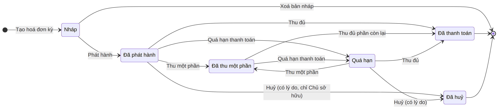

### 3.6.2. Vòng đời yêu cầu sửa chữa

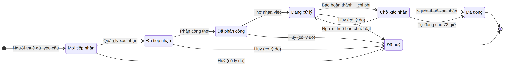

## 3.7. Sơ đồ lớp (Class Diagram)

Mục 3.5 mô tả dữ liệu được **lưu** thế nào. Mục này mô tả dữ liệu đó được **tổ chức thành mã nguồn** thế nào. Hai việc không trùng nhau: một bảng trong cơ sở dữ liệu chỉ chứa dữ liệu, còn một lớp trong mã nguồn chứa cả dữ liệu lẫn hành vi thao tác trên dữ liệu ấy.

Nhóm trình bày hai sơ đồ lớp ở hai mức chi tiết khác nhau, vì chúng phục vụ hai mục đích khác nhau.

### 3.7.1. Mô hình miền tổng thể

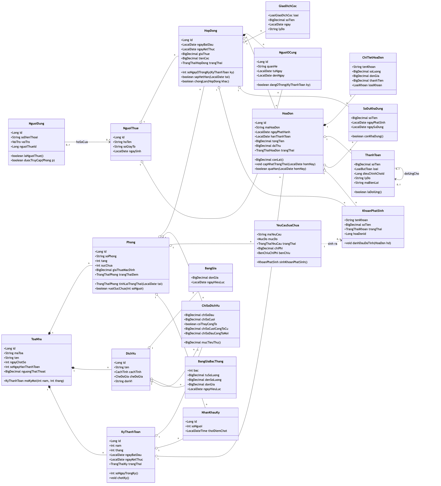

Sơ đồ này cho cái nhìn toàn cảnh. Để giữ được tính dễ đọc, nhóm **rút gọn có chủ đích**: chỉ giữ các lớp miền chính cùng những phương thức nghiệp vụ đáng chú ý, lược bỏ các lớp phụ trợ như hồ sơ phòng cháy chữa cháy, thông báo và nhật ký thao tác — chúng có cấu trúc đơn giản, gần như chỉ là dữ liệu thuần, và việc đưa vào sẽ làm sơ đồ rối mà không thêm thông tin gì.

Ba điểm nên chú ý khi đọc sơ đồ.

**Thứ nhất, các lớp có hành vi, không chỉ có dữ liệu.** Đây là lựa chọn thiết kế có ý thức. Ví dụ `HopDong.soNgayOTrongKy(ky)` — số ngày ở thực tế trong một kỳ theo BR-06 — được đặt **ngay trong lớp `HopDong`**, chứ không nằm rải rác trong các lớp dịch vụ. Lý do: đây là kiến thức về bản chất của hợp đồng, và nếu để bên ngoài thì mỗi chỗ cần dùng sẽ tự tính lại một kiểu, đến lúc quy tắc thay đổi sẽ sót chỗ. Tương tự với `Phong.vuotSucChua(soNguoi)`, `HoaDon.conLai()`, `HopDong.chongLan(khac)` cho BR-10, và `ThanhToan.laDoiUng()`.

**Thứ hai, quan hệ hợp thành phân biệt với quan hệ tập hợp.** Ký pháp không phải để trang trí:

- `ToaNha` **hợp thành** `Phong` (kim cương đặc): xoá một toà nhà thì các phòng của nó không còn ý nghĩa gì, phòng không tồn tại độc lập được.
- `Phong` **tập hợp** `HopDong` (kim cương rỗng): hợp đồng có vòng đời riêng và phải giữ lại được cả sau khi đã thanh lý — đây là dữ liệu lịch sử, xoá phòng không được kéo theo xoá lịch sử thuê.
- `HoaDon` **hợp thành** `ChiTietHoaDon`: một dòng chi tiết không có ý nghĩa gì nếu tách khỏi hoá đơn chứa nó.

**Thứ ba, ba quan hệ mang dấu vết của đợt rà soát ở mục 3.10.** Quan hệ `NguoiDung "0..1" → "0..1" NguoiThue` là kết quả của phiếu CR-001; bội số `0..1` ở cả hai đầu nói đúng hai điều: tài khoản của quản lý không gắn hồ sơ người thuê nào, và người thuê không bắt buộc phải có tài khoản. Quan hệ tự thân `ThanhToan → ThanhToan : doiUngCho` là kết quả của CR-010 — một bút toán đối ứng trỏ về bản ghi gốc mà nó điều chỉnh. Và lớp `KhoanPhatSinh` với phương thức `danhDauDaTinh(hoaDon)` là kết quả của CR-008, phiếu đáng chú ý nhất trong lô.

### 3.7.2. Gói tính tiền — thiết kế chi tiết

Đây là sơ đồ quan trọng nhất của chương. Tính tiền là phần **nhiều quy tắc nhất, dễ sai nhất, và hậu quả khi sai là nặng nhất** của toàn hệ thống — sai một đồng trên hoá đơn là mất niềm tin của người thuê. Vì vậy nhóm tách riêng phần này thành một gói được thiết kế kỹ hơn hẳn các phần còn lại.

**Nguyên tắc bao trùm: toàn bộ gói này là lớp thuần.** Không lớp nào trong `billing.calc` được phụ thuộc vào Spring, vào JPA, vào cơ sở dữ liệu hay vào HTTP. Các lớp ở đây nhận dữ liệu vào qua đối tượng `BoiCanhTinh`, trả kết quả ra qua `KetQuaTinhHoaDon`, và không đọc ghi gì cả.

Ràng buộc này nghe có vẻ khắt khe không cần thiết, nhưng nó đổi lấy một thứ rất cụ thể: **kiểm thử chạy trong mili giây**. Một ca kiểm thử tính tiền chỉ cần dựng một `BoiCanhTinh` trong bộ nhớ rồi gọi hàm, không cần khởi động Spring, không cần cơ sở dữ liệu, không cần dữ liệu mẫu. Nhờ đó việc viết **hàng trăm ca kiểm thử** cho phần tiền bạc trở nên khả thi trong phạm vi một đồ án môn học — điều sẽ không xảy ra nếu mỗi ca kiểm thử mất vài giây để khởi động ngữ cảnh. Chương 6 trình bày cụ thể chiến lược kiểm thử dựa trên tính chất này.

**Bảng 3.5 — Các lớp chính trong gói tính tiền và trách nhiệm**

| Lớp | Vai trò | Ghi chú |
|---|---|---|
| `MayTinhHoaDon` | Điều phối: gọi lần lượt tiền phòng, các dịch vụ, khoản phát sinh, trừ số dư, làm tròn | Là lớp duy nhất biết **thứ tự** các bước; bản thân nó không chứa công thức nào |
| `BoiCanhTinh` | Gói toàn bộ dữ liệu đầu vào của một lần tính: kỳ, hợp đồng, số ngày ở, số người, chỉ số, bảng giá, khoản chờ, số dư | Bất biến. Đây là **ranh giới** giữa phần chạm cơ sở dữ liệu và phần thuần |
| `KetQuaTinhHoaDon` | Gói kết quả: các dòng chi tiết, tổng tiền, và **danh sách lý do bỏ qua** | Xem ghi chú về `LyDoBoQua` bên dưới |
| `ChienLuocTinhTien` | Giao diện cho **cách tính** — bốn cài đặt: theo chỉ số, cố định, theo người, theo số lượng | Ứng đúng bốn giá trị của trường `cachTinh` trong `DICH_VU` |
| `ChienLuocGia` | Giao diện cho **chế độ giá** — hai cài đặt: đơn giá cố định và bậc thang | Ứng đúng hai giá trị của trường `cheDoGia` |
| `GiaBacThang` | Cài đặt BR-02b và BR-02c: chia sản lượng vào các bậc, nới rộng ngưỡng bậc cho hộ trên 4 người | Chứa toàn bộ phần khó nhất của bài toán tính tiền điện |
| `QuyTacLamTron` | Cài đặt BR-15: làm tròn đến nghìn theo quy tắc nửa lên, sinh dòng chênh lệch | Xem ghi chú về dấu âm bên dưới |
| `TienTe` | Bọc `BigDecimal`, cung cấp cộng trừ nhân an toàn | Xem ghi chú về kiểu số bên dưới |

**Vì sao có hai lớp chiến lược lồng nhau.** Đây là chi tiết dễ bị hỏi khi bảo vệ, nên cần nói rõ: hai mẫu chiến lược ở đây **không phải dùng cho có**, mà vì bài toán thực sự có hai trục biến thiên độc lập.

- Trục thứ nhất là **cách xác định số lượng**: đo theo chỉ số công tơ, thu cố định theo tháng, tính theo đầu người, hay tính theo số lượng đăng ký như phí gửi xe.
- Trục thứ hai là **cách quy số lượng ra tiền**: nhân với một đơn giá duy nhất, hay chia vào các bậc rồi cộng lại.

Hai trục này cắt nhau. Điện dùng *theo chỉ số × bậc thang*; nước dùng *theo chỉ số × đơn giá cố định* ở toà này nhưng có thể *theo người × đơn giá cố định* ở toà khác. Nếu gộp thành một cấp chiến lược duy nhất, số lớp sẽ là tích của hai trục và phần tính bậc thang bị chép lại ở nhiều nơi. Tách thành hai cấp thì mỗi trục có số lớp bằng đúng số giá trị của nó, và **`GiaBacThang` — phần khó nhất — chỉ tồn tại đúng một bản, được kiểm thử đúng một lần**.

**Vì sao có lớp `TienTe` bọc quanh `BigDecimal`.** Trong Java, `double` và `float` là kiểu dấu phẩy động nhị phân, không biểu diễn chính xác được các số thập phân thông thường — phép tính `0.1 + 0.2` cho kết quả `0.30000000000000004`. Với phần mềm tính tiền, sai số kiểu này tích luỹ qua nhiều dòng chi tiết và cuối cùng làm tổng hoá đơn lệch. Toàn bộ hệ thống vì vậy dùng `BigDecimal` ở tầng mã nguồn và kiểu `NUMERIC(15,2)` ở tầng cơ sở dữ liệu.

Điều đáng nói là quy ước này **không được để ở dạng lời dặn nhau**. Nhóm viết một luật ArchUnit chạy cùng bộ kiểm thử, quét toàn bộ mã nguồn tìm khai báo `double` hoặc `float` trong các gói nghiệp vụ; phát hiện vi phạm là **gãy build**. Cùng cơ chế đó, một luật thứ hai kiểm rằng không lớp nào trong `billing.calc` phụ thuộc vào Spring hay JPA. Hai luật này biến hai nguyên tắc thiết kế ở trên từ **thoả thuận miệng thành ràng buộc máy kiểm được** — chi tiết ở Chương 6.

**Vì sao dòng làm tròn có thể mang dấu âm.** BR-15 quy định làm tròn đến 1.000 đồng theo **quy tắc nửa lên**, không phải làm tròn lên. Hai cách này khác nhau: với tổng 1.887.200 đồng, nửa lên cho 1.887.000 còn làm tròn lên cho 1.888.000. Hệ quả với người cài đặt: dòng chênh lệch do `QuyTacLamTron` sinh ra **có thể âm**, nên trường số tiền của dòng chi tiết không được đặt ràng buộc phải dương. Đây đúng là loại chi tiết chỉ lộ ra khi đọc kỹ quy tắc, và nếu bỏ sót thì lỗi sẽ chỉ xuất hiện ở một phần các hoá đơn.

**Vì sao có `LyDoBoQua` thay vì ném ngoại lệ.** Luồng ngoại lệ E1 và E3 của UC-10 yêu cầu: khi một phòng thiếu chỉ số hoặc thiếu đơn giá thì **bỏ qua phòng đó và vẫn tạo hoá đơn cho các phòng còn lại**, đồng thời báo rõ lý do. Nếu cài đặt bằng cách ném ngoại lệ, cả mẻ tính sẽ dừng ở phòng lỗi đầu tiên — trái với đặc tả. Lớp `LyDoBoQua` biến việc bỏ qua thành **một giá trị trả về bình thường**, để `MayTinhHoaDon` gom hết lý do rồi trả về cùng kết quả, đúng như bước 7 của luồng chính yêu cầu.

## 3.8. Sơ đồ tuần tự (Sequence Diagram)

Sơ đồ lớp cho biết hệ thống có những thành phần nào. Sơ đồ tuần tự cho biết **khi một chức năng chạy thì các thành phần đó gọi nhau theo thứ tự nào**. Nhóm dựng bốn sơ đồ tuần tự, chọn theo tiêu chí: mỗi sơ đồ phải làm rõ được một thứ mà các sơ đồ khác trong chương không diễn đạt được.

| Sơ đồ | Use case | Làm rõ điều gì |
|---|---|---|
| Hình 3.17 | UC-10 Tạo hoá đơn kỳ | Quy trình lõi, phức tạp nhất — 36 thông điệp, 4 luồng ngoại lệ |
| Hình 3.18 | UC-09 Ghi chỉ số | Xử lý trường hợp thay công tơ và cảnh báo bất thường |
| Hình 3.19 | UC-12 Ghi nhận thanh toán | Nguyên tắc không sửa bản ghi tiền, chỉ lập bút toán đối ứng |
| Hình 3.20 | UC-19, UC-20 Cổng người thuê | Cơ chế chặn truy cập chéo giữa các phòng |

### 3.8.1. UC-10 — Tạo hoá đơn kỳ

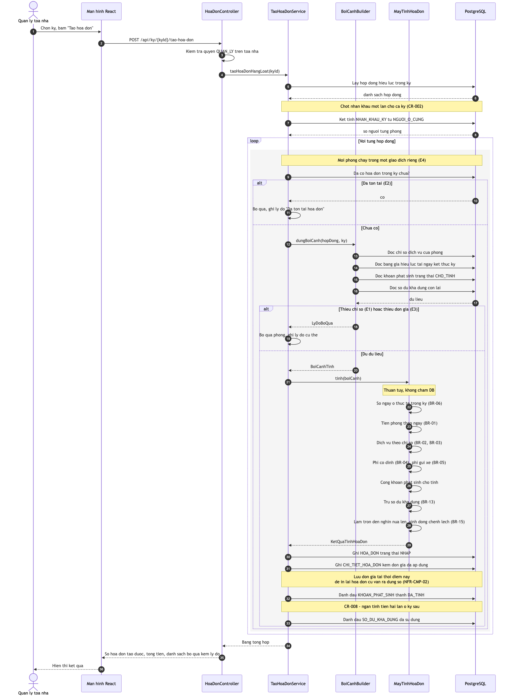

Sơ đồ bám sát đặc tả ở mục 3.2: đủ 7 bước của luồng chính và đủ 4 luồng ngoại lệ E1–E4, mỗi bước có ghi mã quy tắc nghiệp vụ tương ứng ngay trên sơ đồ.

**Bảng 3.6 — Đối chiếu bước trong đặc tả UC-10 với thông điệp trên sơ đồ**

| Bước / mã | Nội dung trong đặc tả | Thể hiện trên sơ đồ |
|---|---|---|
| 1 | Lấy danh sách hợp đồng hiệu lực | `SV → DB: Lay hop dong hieu luc trong ky` |
| 2 | Xác định số ngày ở thực tế (BR-06) | Bước trong `MayTinhHoaDon`, sau khi đã dựng bối cảnh |
| 3 | Tính tiền phòng và dịch vụ (BR-01 → BR-05) | Bốn dòng tự gọi liên tiếp trong `MayTinhHoaDon` |
| 4 | Cộng khoản phát sinh đang chờ | `CTX → DB: Doc khoan phat sinh trang thai CHO_TINH` |
| 5 | Trừ số dư (BR-13), làm tròn (BR-15) | Hai dòng tự gọi cuối cùng trước khi trả kết quả |
| 6 | Ghi hoá đơn Nháp kèm chi tiết và đơn giá đã áp dụng | Ba lệnh ghi vào `DB`, kèm chú thích NFR-CMP-02 |
| 7 | Hiển thị bảng tổng hợp kèm lý do bỏ qua | `SV → API: Bang tong hop` |
| E1, E3 | Thiếu chỉ số hoặc thiếu đơn giá | Khối `alt` trả về `LyDoBoQua`, vòng lặp vẫn chạy tiếp |
| E2 | Đã có hoá đơn trong kỳ | Khối `alt` ở đầu vòng lặp |
| E4 | Lỗi khi tính một phòng | Khối `rect` bao quanh thân vòng lặp — mỗi phòng một giao dịch riêng |

Ba chi tiết trên sơ đồ đáng dừng lại.

**Ranh giới giữa phần chạm cơ sở dữ liệu và phần thuần.** Mọi lệnh đọc dữ liệu đều nằm ở `BoiCanhBuilder`, phía trên; khi quyền điều khiển chuyển sang `MayTinhHoaDon` thì không còn mũi tên nào đi tới `PostgreSQL` nữa. Đây chính là nguyên tắc lớp thuần ở mục 3.7.2, nhìn ở dạng khác: **sơ đồ tuần tự làm cho ranh giới ấy thành thứ nhìn thấy được**.

**Mỗi phòng chạy trong một giao dịch riêng.** Khối `rect` bao quanh thân vòng lặp thể hiện luồng ngoại lệ E4: nếu tính sai ở một phòng thì chỉ thay đổi của riêng phòng đó bị huỷ, không để lại hoá đơn dở dang, và vòng lặp vẫn chạy tiếp sang phòng sau. Nếu đặt cả mẻ trong một giao dịch duy nhất, một phòng lỗi sẽ kéo đổ toàn bộ công việc của cả toà nhà.

**Hai chú thích mang dấu vết đợt rà soát.** Việc chốt nhân khẩu **một lần cho cả kỳ** trước khi vào vòng lặp là kết quả của CR-002 — nếu đọc số người ở tại thời điểm tính thì hoá đơn in lại sau vài tháng sẽ ra số khác, vi phạm NFR-CMP-02. Việc **đánh dấu khoản phát sinh thành `DA_TINH`** ngay sau khi ghi hoá đơn là kết quả của CR-008; thiếu bước này, kỳ sau hệ thống sẽ quét lại và thu tiền lặp cùng một khoản sửa chữa.

### 3.8.2. UC-09 — Ghi chỉ số điện nước

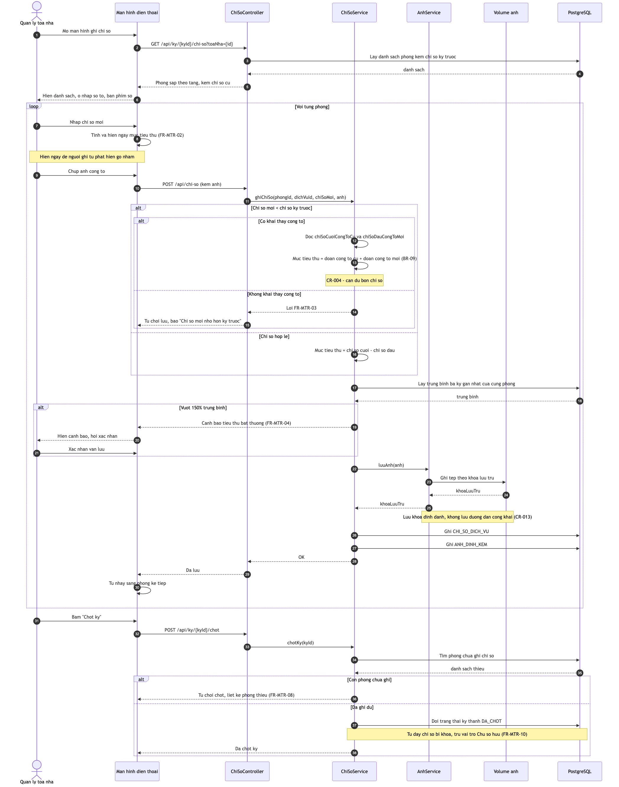

Sơ đồ này được dựng với một bối cảnh sử dụng cụ thể trong đầu: người quản lý cầm điện thoại, đứng giữa hành lang, sóng yếu. Ba quyết định thiết kế đến từ bối cảnh đó.

**Hiển thị mức tiêu thụ ngay khi vừa nhập, ở phía giao diện, trước cả khi gửi lên máy chủ.** Mục đích không phải để tiết kiệm lời gọi mạng mà là để **người ghi tự phát hiện gõ nhầm**: một con số tiêu thụ 3.400 kWh hiện ra lập tức thì ai cũng biết là sai, còn nếu chỉ hiện chỉ số công tơ thì rất khó nhận ra.

**Việc thay công tơ cần đủ bốn chỉ số.** Khối `alt` xử lý trường hợp chỉ số mới nhỏ hơn chỉ số kỳ trước phân biệt hai tình huống: có khai thay công tơ thì mức tiêu thụ bằng *đoạn cuối của công tơ cũ cộng đoạn đầu của công tơ mới* theo BR-09; không khai thì từ chối lưu theo FR-MTR-03. Đây là phiếu CR-004 — mô hình phiên bản 1.0 chỉ có một cờ đánh dấu đã thay công tơ, và cờ đó **không mang đủ dữ liệu để tính**.

**Ảnh lưu bằng khoá định danh, không lưu đường dẫn công khai.** Đây là phiếu CR-013, và hệ quả của nó hiện rõ ở Hình 3.20.

### 3.8.3. UC-12 — Ghi nhận thanh toán

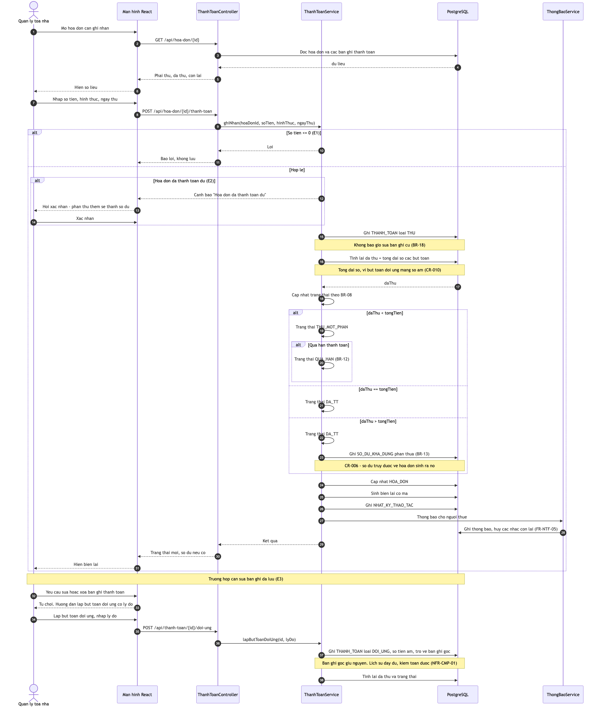

Sơ đồ này minh hoạ một nguyên tắc kế toán mà hệ thống áp dụng triệt để: **bản ghi tiền đã lưu thì không sửa, không xoá**. Khi cần điều chỉnh, người dùng lập một **bút toán đối ứng** — một bản ghi mới mang số tiền âm, có lý do, trỏ về bản ghi gốc. Bản ghi gốc giữ nguyên.

Nguyên tắc này có hai hệ quả kỹ thuật thấy được trên sơ đồ. Thứ nhất, số tiền đã thu **luôn được tính lại bằng tổng đại số** của các bút toán, không bao giờ được cộng dồn vào một trường sẵn có — vì trong tổng đó có những số âm. Thứ hai, trường số tiền của bảng `THANH_TOAN` **không đặt ràng buộc phải dương**, đúng như phiếu CR-010 đã nêu.

Phần cuối sơ đồ thể hiện luồng ngoại lệ E3 dưới dạng một cuộc đối thoại: người dùng yêu cầu sửa bản ghi, hệ thống **từ chối** và hướng dẫn lập bút toán đối ứng. Cách trình bày này cố ý — nó cho thấy việc từ chối là **hành vi thiết kế**, không phải chức năng còn thiếu.

### 3.8.4. UC-19 và UC-20 — Cổng người thuê

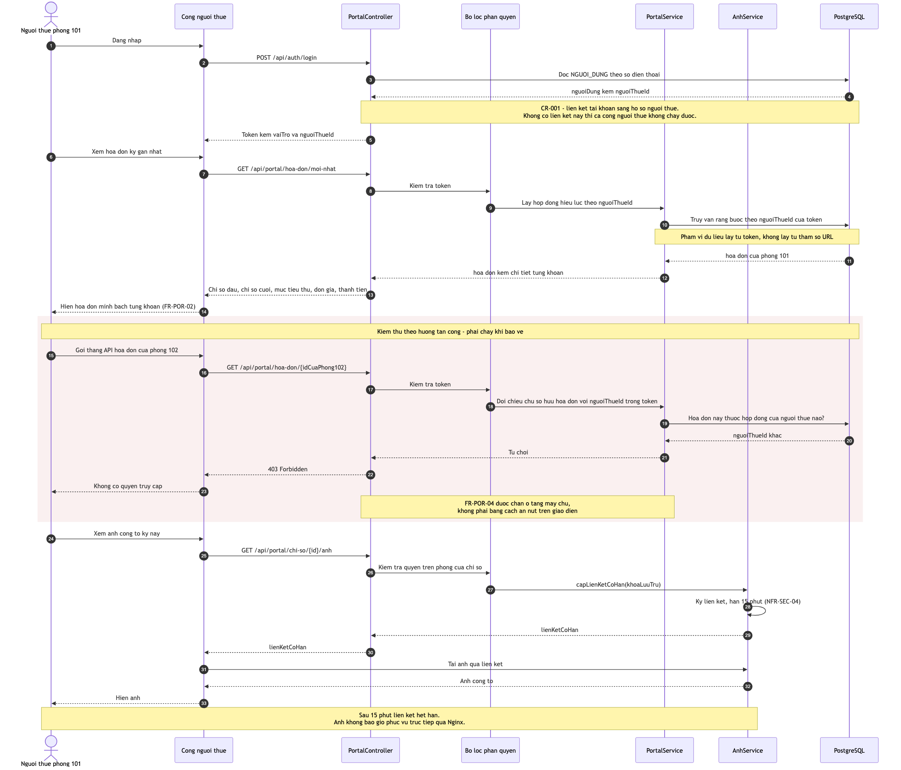

Sơ đồ này có một khối được tô nền riêng, mô tả **một thử nghiệm tấn công**: người thuê phòng 101, sau khi đăng nhập hợp lệ, gọi thẳng vào địa chỉ API hoá đơn của phòng 102. Hệ thống trả về `403 Forbidden`.

Khối đó được đưa vào sơ đồ có chủ đích, vì nó làm rõ một điểm hay bị hiểu sai. Yêu cầu FR-POR-04 — *người thuê chỉ truy cập được dữ liệu của phòng mình* — **không thể thoả mãn bằng cách ẩn nút trên giao diện**. Giao diện chạy trên máy người dùng và có thể bị bỏ qua hoàn toàn; ai cũng gọi thẳng API được. Việc chặn vì vậy phải nằm ở **tầng máy chủ**, và cụ thể hơn: phạm vi dữ liệu phải lấy từ **danh tính trong token**, không được lấy từ tham số trên địa chỉ URL. Nếu lấy từ tham số, người dùng chỉ cần đổi một con số trên thanh địa chỉ là xem được hoá đơn phòng khác.

Sơ đồ cũng cho thấy hai chi tiết còn lại của luồng này. Việc đăng nhập truy được từ tài khoản sang hồ sơ người thuê là nhờ liên kết do phiếu CR-001 bổ sung — **không có liên kết này thì toàn bộ cổng người thuê không chạy được**, vì hệ thống không biết người vừa đăng nhập ứng với hợp đồng nào. Và ảnh công tơ không bao giờ được phục vụ trực tiếp: mỗi lần xem, hệ thống cấp một **liên kết ký hạn 15 phút**, đúng theo NFR-SEC-04.

## 3.9. Kiến trúc phần mềm

Các mục trước mô tả từng phần của hệ thống. Mục này mô tả **cách xếp các phần đó lại với nhau**.

### 3.9.1. Kiến trúc phân tầng

Hệ thống theo kiến trúc phân tầng cổ điển, gồm năm tầng với một quy tắc phụ thuộc duy nhất: **tầng trên gọi tầng dưới, không có chiều ngược lại**.

| Tầng | Thành phần | Trách nhiệm | Được phép phụ thuộc vào |
|---|---|---|---|
| Giao diện | React chạy trên trình duyệt | Hiển thị, nhập liệu, kiểm tra sơ bộ | Chỉ gọi API qua HTTP |
| Tiếp nhận | `*Controller` | Nhận yêu cầu HTTP, kiểm quyền, chuyển đổi dữ liệu vào ra | Tầng nghiệp vụ |
| Nghiệp vụ | `*Service` | Điều phối quy trình, quản lý giao dịch | Tầng miền, tầng truy xuất |
| Miền | Lớp miền và gói `billing.calc` | Chứa quy tắc nghiệp vụ | **Không phụ thuộc gì cả** |
| Truy xuất | `*Repository`, Flyway | Đọc ghi cơ sở dữ liệu, di trú lược đồ | PostgreSQL |

Điểm cần nhấn ở bảng trên là dòng **tầng miền**. Đây là tầng chứa toàn bộ giá trị nghiệp vụ của hệ thống, và nó được thiết kế để **không biết gì về thế giới bên ngoài**: không biết dữ liệu đến từ HTTP hay từ một tệp, không biết kết quả sẽ được lưu vào PostgreSQL hay in ra màn hình. Kiểm tra ở tầng giao diện — chẳng hạn chặn nhập số âm — là để người dùng biết sớm, **không được coi là biện pháp bảo vệ**; mọi kiểm tra thật đều lặp lại ở tầng máy chủ, vì tầng giao diện chạy trên máy người dùng và có thể bị bỏ qua.

### 3.9.2. Phân rã module

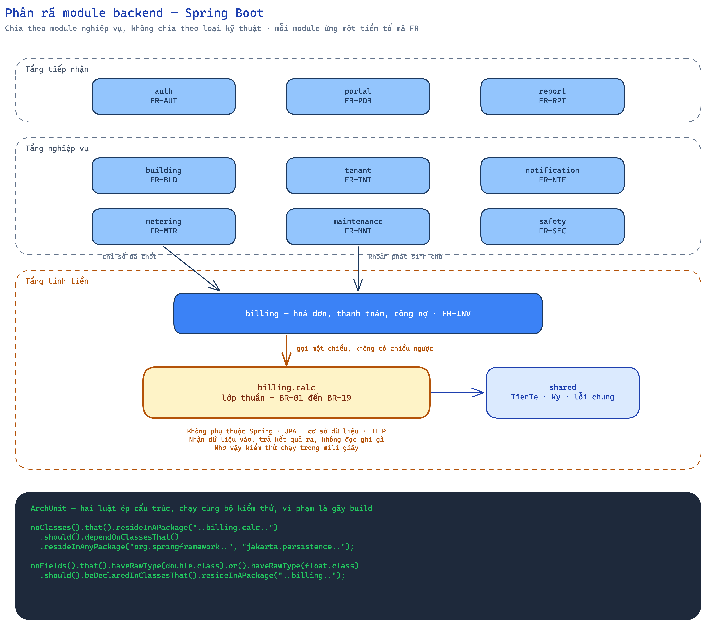

Mã nguồn phía máy chủ được chia thành mười module nghiệp vụ. Nguyên tắc chia: **theo module nghiệp vụ, không theo loại kỹ thuật.** Nghĩa là không gom tất cả `Controller` vào một gói, tất cả `Service` vào một gói khác; thay vào đó mỗi module chứa đủ cả controller, service, repository và lớp miền của riêng nó.

Lý do rất thực tế: khi sửa một chức năng, gần như toàn bộ thay đổi nằm gọn trong **một thư mục**. Với cách chia theo loại kỹ thuật, cùng thay đổi ấy sẽ rải ra bốn thư mục khác nhau, và người đọc lịch sử mã nguồn về sau khó lần lại được một thay đổi đã đụng những đâu.

**Bảng 3.7 — Mười module và ánh xạ sang mã yêu cầu**

| Tầng trong sơ đồ | Module | Tiền tố mã yêu cầu | Nội dung |
|---|---|---|---|
| Tiếp nhận | `auth` | FR-AUT | Đăng nhập, phân quyền theo vai trò và theo toà nhà |
| Tiếp nhận | `portal` | FR-POR | Cổng người thuê |
| Tiếp nhận | `report` | FR-RPT | Báo cáo, thống kê, màn hình tổng quan |
| Nghiệp vụ | `building` | FR-BLD | Toà nhà, phòng, dịch vụ, biểu giá |
| Nghiệp vụ | `tenant` | FR-TNT | Người thuê, hợp đồng, người ở cùng |
| Nghiệp vụ | `metering` | FR-MTR | Ghi chỉ số, ảnh công tơ, chốt kỳ |
| Nghiệp vụ | `maintenance` | FR-MNT | Yêu cầu sửa chữa, phân công, chi phí |
| Nghiệp vụ | `notification` | FR-NTF | Thông báo, nhắc việc, nhắc hạn |
| Nghiệp vụ | `safety` | FR-SEC | Phòng cháy chữa cháy, hồ sơ cư trú, nhật ký thao tác |
| Tính tiền | `billing` | FR-INV | Hoá đơn, thanh toán, công nợ |

Ánh xạ này là **một-đối-một**: mỗi module ứng đúng một tiền tố mã yêu cầu, không có module nào không có yêu cầu và không có tiền tố nào không có module. Nhờ đó, từ một mã yêu cầu bất kỳ trong Chương 2 có thể suy ra ngay mã nguồn của nó nằm ở thư mục nào — đây là một mắt xích của chuỗi truy vết mà mục 2.6.4 đòi hỏi.

Ngoài mười module trên, sơ đồ còn hai gói đặc biệt:

- **`shared`** chứa những thứ mọi module đều cần: lớp `TienTe`, lớp `Ky`, các lớp lỗi chung. Gói này cố ý giữ **rất nhỏ** — một gói dùng chung phình to là dấu hiệu các module đang dính chặt vào nhau.
- **`billing.calc`** là gói thuần đã mô tả ở mục 3.7.2. Trên sơ đồ, quan hệ giữa `billing` và `billing.calc` được vẽ là **gọi một chiều, không có chiều ngược**, kèm hai luật ArchUnit ép đúng điều đó. Một trong hai luật, viết ra thì rất ngắn, đại ý: *không lớp nào nằm trong `..billing.calc..` được phép phụ thuộc vào `org.springframework..` hoặc `jakarta.persistence..`*. Luật chạy cùng bộ kiểm thử, vi phạm là gãy build.

### 3.9.3. Kiến trúc triển khai

Kiến trúc **vật lý** — máy chủ, container, mạng, tường lửa — thuộc phạm vi Chương 4 và được trình bày đầy đủ ở mục 4.5. Mục này chỉ nêu hai ràng buộc mà kiến trúc triển khai **áp ngược trở lại** thiết kế phần mềm, để hai chương không nói ngược nhau:

1. **Cơ sở dữ liệu không mở cổng ra ngoài.** PostgreSQL chỉ nằm trong mạng nội bộ của Docker, chỉ container ứng dụng gọi được. Hệ quả với thiết kế: không có thành phần nào ngoài tầng truy xuất được nói chuyện trực tiếp với cơ sở dữ liệu — kể cả công cụ quản trị hay script báo cáo.
2. **Ảnh không được phục vụ trực tiếp.** Máy chủ web không có bất kỳ đường dẫn nào trỏ vào thư mục ảnh. Hệ quả với thiết kế: mọi lượt xem ảnh đều phải đi qua `AnhService` để lấy liên kết ký hạn 15 phút, đúng như Hình 3.18 và Hình 3.20 đã thể hiện.

## 3.10. Rà soát và hiệu chỉnh mô hình

### 3.10.1. Mục đích và phương pháp

Sau khi hoàn tất mô hình dữ liệu phiên bản 1.0, nhóm không chuyển ngay sang lập trình mà dành một đợt rà soát để trả lời **một câu hỏi duy nhất**:

> Với sơ đồ thực thể quan hệ hiện tại, có thực hiện được **từng quy tắc nghiệp vụ** đã đặc tả hay không?

Câu hỏi này khác với câu hỏi thông thường *"mô hình đã đủ bảng chưa"*. Nó cụ thể hơn, và quan trọng hơn là **kiểm được**. Phương pháp gồm ba bước, lặp cho từng quy tắc trong số 23 quy tắc nghiệp vụ ở mục 2.4.4:

1. Đọc công thức của quy tắc, liệt kê **những trường dữ liệu mà công thức đó cần đọc**.
2. Đối chiếu từng trường với mô hình: trường này nằm ở bảng nào? Nếu không có bảng nào chứa nó thì quy tắc **không thực hiện được**.
3. Nếu trường có tồn tại, kiểm tiếp: nó có **truy được tới** từ điểm bắt đầu của quy trình không, tức có đủ chuỗi khoá ngoại để đi từ dữ liệu đầu vào đến trường đó không.

Bước 3 là bước hay bị bỏ qua nhất, và cũng là bước làm lộ ra phiếu nặng nhất của lô — CR-001.

**Kết quả: 15 vấn đề, trong đó 10 vấn đề thuộc loại chặn** — quy tắc đã đặc tả không thể thực hiện với mô hình hiện tại. Đợt rà soát diễn ra **trước khi tài liệu được thông qua làm baseline**, nên theo mục 2.6.1, các thay đổi này chưa phải thay đổi baseline. Nhóm vẫn lập phiếu đầy đủ theo mẫu quy trình quản lý thay đổi ở mục 2.6.3, vì hai lý do: ghi lại được **lý do đằng sau mỗi quyết định thiết kế** — thứ sẽ thất lạc nếu chỉ lặng lẽ sửa sơ đồ; và kiểm chứng chính quy trình quản lý thay đổi bằng một tình huống thật, thay vì để nó là quy trình chỉ tồn tại trên giấy.

### 3.10.2. Tổng hợp kết quả

**Bảng 3.8 — Tổng hợp mười lăm phiếu thay đổi của lô số 01**

| Mã | Vấn đề | Mức | Ảnh hưởng nặng nhất | Công thêm |
|---|---|---|---|---|
| CR-001 | Không có liên kết tài khoản ↔ người thuê | Chặn | Sập toàn bộ EP-08 (9 FR) | 4 giờ |
| CR-002 | Không lưu được số người ở theo kỳ | Chặn | BR-02c, BR-03 | 8 giờ |
| CR-003 | Không lưu được biểu giá điện bậc thang | Chặn | BR-02b, FR-BLD-08 | 6 giờ |
| CR-004 | Không đủ chỉ số để tính khi thay công tơ | Chặn | BR-09, FR-MTR-09 | 3 giờ |
| CR-005 | Trạng thái hợp đồng thiếu giá trị "đã cọc" | Chặn | BR-11 | 2 giờ |
| CR-006 | Không có nơi lưu số dư khả dụng | Chặn | BR-13, FR-INV-16 | 3 giờ |
| CR-007 | Không có thực thể công tơ tổng | Chặn | BR-19, FR-RPT-06 | 3 giờ |
| CR-008 | Không có thực thể khoản phát sinh chờ | Chặn | FR-MNT-06, rủi ro thu tiền lặp | 5 giờ |
| CR-009 | Không có bản ghi thu tiền cọc | Chặn | BR-07, US-09 | 4 giờ |
| CR-010 | Thanh toán thiếu trường cho bút toán đối ứng | Chặn | BR-18, FR-INV-14 | 2 giờ |
| CR-011 | Thuế GTGT xuất hiện rồi biến mất | Mâu thuẫn | BR-02b | 1 giờ |
| CR-012 | Trạng thái suy ra hay trạng thái lưu | Mâu thuẫn | BR-11, BR-14 | 4 giờ |
| CR-013 | Lưu địa chỉ ảnh đi ngược NFR-SEC-04 | Mâu thuẫn | NFR-SEC-04 | 3 giờ |
| CR-014 | Ràng buộc ngân sách không còn đúng | Cập nhật | C-02, NFR-SEC-01 | 1 giờ |
| CR-015 | Cơ cấu biểu giá điện đã đổi từ 6 bậc sang 5 bậc | Sai dữ kiện | BR-02b, BR-02c, R2 | 3 giờ |
| | | | **Tổng** | **52 giờ** |

Toàn bộ mười lăm phiếu đều được **chấp nhận** và đã áp dụng vào tài liệu phân tích yêu cầu phiên bản 1.1 cùng mô hình dữ liệu phiên bản 2 ở mục 3.5. Nội dung đầy đủ của từng phiếu — mô tả, lý do, danh sách yêu cầu bị ảnh hưởng, ghi chú thiết kế — đặt ở phụ lục lô phiếu thay đổi số 01.

Ba mục nhỏ dưới đây phân tích sâu ba phiếu, chọn vì mỗi phiếu đại diện cho **một loại vấn đề khác nhau**, và vì mỗi phiếu cho một bài học khác nhau.

### 3.10.3. CR-001 — lỗi thiếu liên kết

**Vấn đề.** Mô hình phiên bản 1.0 tách `NGUOI_DUNG` (tài khoản đăng nhập) và `NGUOI_THUE` (hồ sơ nhân thân) thành hai thực thể, **không có bất kỳ quan hệ nào nối chúng**.

Điều đáng nói: **quyết định tách là đúng**. Không phải người thuê nào cũng có tài khoản — nhiều người chỉ dùng giấy tờ và trao đổi trực tiếp với quản lý; ngược lại tài khoản của chủ sở hữu, quản lý, thợ sửa chữa không gắn với hồ sơ người thuê nào. Một người thuê cũng có thể ký nhiều hợp đồng qua thời gian. Gộp hai thực thể sẽ tạo ra một bảng đầy trường rỗng.

Sai sót nằm ở chỗ khác: tách xong thì **quên nối lại**.

**Hậu quả.** Khi một người thuê đăng nhập, hệ thống không có cách nào xác định tài khoản đó ứng với hồ sơ người thuê nào. Không truy ra được hồ sơ thì không truy ra được hợp đồng, không ra hợp đồng thì không ra phòng, không ra phòng thì không ra hoá đơn. **Toàn bộ epic EP-08 — cổng người thuê, 9 yêu cầu chức năng trong đó 5 mức Must have — sập hoàn toàn.**

Nặng nhất là FR-POR-04: *người thuê chỉ truy cập được dữ liệu của phòng mình*. Đây là yêu cầu **an ninh**, và thiếu liên kết thì nó không những không cài đặt được mà còn **không kiểm thử được** — không có gì để đối chiếu xem hoá đơn đang xem có thuộc về người đang đăng nhập hay không.

**Xử lý.** Thêm trường khoá ngoại `nguoi_thue_id` vào bảng `NGUOI_DUNG`, **cho phép rỗng** và **đặt ràng buộc duy nhất**. Cho phép rỗng vì các vai trò không phải người thuê không có hồ sơ; ràng buộc duy nhất để một hồ sơ người thuê không bị hai tài khoản cùng nhận là mình. Ở tầng ứng dụng thêm một quy tắc: khi vai trò là người thuê thì trường này bắt buộc phải có giá trị.

**Bài học.** Phiếu này lộ ra ở **bước 3** của phương pháp — bước kiểm tính truy được, không phải bước kiểm sự tồn tại của trường. Cả hai bảng đều tồn tại, mọi trường cần thiết đều tồn tại; thứ thiếu là **con đường đi giữa chúng**. Nếu chỉ rà theo kiểu "đã có đủ bảng chưa", lỗi này sẽ lọt qua và chỉ lộ ra khi có người bắt tay viết chức năng đăng nhập của cổng người thuê.

### 3.10.4. CR-008 — lỗi im lặng có hậu quả tiền bạc

**Vấn đề.** UC-10 bước 4 và FR-MNT-06 yêu cầu cộng **các khoản phát sinh đang chờ** vào hoá đơn, chẳng hạn chi phí sửa chữa mà người thuê phải chịu. Mô hình phiên bản 1.0 có trường `chi_phi` và `ben_chiu_chi_phi` trong bảng `YEU_CAU_SUA_CHUA`, nhưng **không có gì đánh dấu khoản đó đã được tính vào hoá đơn nào chưa**.

**Hậu quả.** Đây không đơn thuần là thiếu dữ liệu. Hãy lần theo hệ quả: quy trình tạo hoá đơn tháng 9 quét các yêu cầu sửa chữa của phòng, thấy một khoản 500.000 đồng, cộng vào hoá đơn. Tháng 10, quy trình quét lại, **vẫn thấy đúng khoản đó**, và cộng tiếp. Tháng 11 lại cộng. Người thuê **bị thu tiền lặp mỗi tháng cho một lần sửa chữa duy nhất**.

Điều khiến phiếu này nguy hiểm hơn hẳn chín phiếu chặn còn lại: **chương trình không báo lỗi**. Không có ngoại lệ nào được ném ra, không có dòng nào trong nhật ký, không có kiểm thử đơn vị nào đỏ. Hoá đơn vẫn được tạo, vẫn có tổng tiền hợp lệ, chỉ là **sai**. Lỗi loại này có thể tồn tại rất lâu, cho tới khi có người thuê để ý và khiếu nại — mà lúc đó thiệt hại đã không còn là kỹ thuật nữa.

**Xử lý.** Thêm bảng `KHOAN_PHAT_SINH` với trường `trang_thai` nhận giá trị `CHO_TINH` hoặc `DA_TINH`, cùng khoá ngoại `hoa_don_id` trỏ tới hoá đơn đã tiêu khoản đó. Quy trình tạo hoá đơn chỉ quét các khoản `CHO_TINH`, và **ngay sau khi ghi hoá đơn thì đánh dấu chúng thành `DA_TINH`** — bước này thấy được trên Hình 3.17.

Bảng còn có cặp trường `nguon_loai` và `nguon_id`, cho phép khoản phát sinh đến từ nhiều nguồn khác nhau — sửa chữa, đền bù tài sản hỏng, phạt vi phạm nội quy — mà không phải thêm bảng mới cho từng loại. Đánh đổi của cách này: cơ sở dữ liệu **không kiểm được ràng buộc khoá ngoại** cho một khoá đa hình như vậy, nên phải kiểm ở tầng ứng dụng và phải có kiểm thử riêng. Nhóm nêu rõ đánh đổi ở đây để người đọc hiểu đây là lựa chọn có cân nhắc, không phải sơ suất.

**Bài học.** Một lỗi làm chương trình dừng lại và báo đỏ là lỗi **rẻ**: nó tự tố cáo mình. Lỗi đắt là lỗi vẫn cho ra kết quả trông hợp lệ. Với phần mềm chạm tới tiền, cần chủ động đặt câu hỏi *"nếu quy trình này chạy hai lần thì sao"* cho mọi bước có tác dụng phụ — và trong mô hình dữ liệu phải có chỗ để trả lời câu hỏi đó.

### 3.10.5. CR-015 — lỗi dữ kiện, và cái giá của việc trích dẫn qua loa

**Vấn đề.** Phiếu này khác mười bốn phiếu trước ở bản chất: nó **không phải lỗi thiết kế mà là lỗi dữ kiện**, và nó không được tìm ra bằng phương pháp ở mục 3.10.1.

Nó lộ ra hoàn toàn tình cờ. Khi chuẩn hoá danh mục tài liệu tham khảo cho đúng chuẩn trích dẫn, nhóm phát hiện mục R2 của phiên bản 1.0 chỉ ghi *"Quyết định về giá bán lẻ điện sinh hoạt 6 bậc, áp dụng từ 10/5/2025"* — **không có số hiệu văn bản**. Đi tra để bổ sung số hiệu thì phát hiện: **Quyết định 14/2025/QĐ-TTg ngày 29/5/2025 đã rút biểu giá điện sinh hoạt từ 6 bậc xuống 5 bậc.** Biểu 6 bậc mà tài liệu đang dùng đã bị thay thế.

Phát hiện thêm, ảnh hưởng tới cách thiết kế bảng giá: quyết định này **không quy định đơn giá từng bậc bằng số tiền cố định, mà bằng tỷ lệ phần trăm của giá bán lẻ điện bình quân**. Đơn giá cụ thể quy đổi từ mức bình quân 2.204,0655 đ/kWh theo Quyết định 1279/QĐ-BCT ngày 09/5/2025 của Bộ Công Thương.

**Xử lý.** Sửa BR-02b sang cơ cấu 5 bậc, bổ sung cột tỷ lệ, cập nhật phát hiện D4 trong phần phân tích tài liệu ở Chương 2 và toàn bộ danh mục tài liệu tham khảo. Bảng `BANG_GIA_BAC_THANG` được bổ sung trường `ty_le` bên cạnh trường đơn giá — lưu **cả hai**, vì khi Nhà nước điều chỉnh giá điện thì thông thường chỉ giá bình quân thay đổi còn các tỷ lệ giữ nguyên; giữ tỷ lệ cho phép cập nhật toàn bộ biểu giá bằng một thao tác, còn giữ đơn giá đã quy đổi để hoá đơn cũ in lại vẫn ra đúng số cũ.

**Bài học thứ nhất — trích dẫn đầy đủ là một cơ chế phát hiện lỗi.** Việc ghi đủ số hiệu và ngày ban hành của văn bản pháp quy thường bị xem là hình thức học thuật, làm cho có. Trường hợp này cho thấy nó có tác dụng rất cụ thể: **nếu phiên bản 1.0 đã ghi số hiệu ngay từ đầu, sai lệch này đã được phát hiện sớm hơn nhiều** — bởi muốn ghi số hiệu thì buộc phải mở văn bản gốc ra, mà mở ra thì thấy ngay nó đã bị thay thế. Một dữ kiện không có nguồn là một dữ kiện không ai kiểm lại được.

**Bài học thứ hai — thiết kế tốt trả cổ tức về sau.** Một thay đổi pháp lý làm đổi **số bậc** của biểu giá lẽ ra là thay đổi lớn. Nhưng bảng `BANG_GIA_BAC_THANG` do phiếu CR-003 đề xuất lưu **mỗi bậc một dòng** thay vì mỗi bậc một cột. Nhờ đó cơ cấu 5 bậc hay 6 bậc đều chứa được mà **không phải sửa một dòng cấu trúc bảng nào**, cũng không phải viết tệp di trú dữ liệu nào.

Hãy so sánh với phương án còn lại. Nếu bảng được thiết kế với các cột `don_gia_bac_1` đến `don_gia_bac_6` — cách làm trực giác hơn và rất hay gặp — thì phiếu CR-015 sẽ kéo theo: sửa cấu trúc bảng, viết tệp di trú, sửa mã nguồn đọc bảng, sửa dữ liệu đã có, sửa cả kiểm thử. Và nếu ngày mai cơ cấu đổi lần nữa thì lặp lại toàn bộ.

Hơn thế, vì mỗi dòng mang `ngay_hieu_luc` riêng nên biểu 6 bậc cũ và biểu 5 bậc mới **cùng tồn tại trong một bảng**: hoá đơn của kỳ trước ngày 29/5/2025 vẫn tra ra biểu cũ và in lại đúng số cũ, đúng như NFR-CMP-02 yêu cầu. Đây là ví dụ cụ thể cho thấy một quyết định thiết kế đúng không chỉ giải quyết bài toán hôm nay, mà còn **hấp thụ được thay đổi chưa biết trước của ngày mai**.

### 3.10.6. Nhận xét về phương pháp

Mười lăm phiếu phát sinh thêm khoảng **52 giờ công**, tương đương chừng 8 điểm ước lượng — khoảng **4,7%** so với tổng 171 điểm của phạm vi Must have cộng Should have.

Con số đó không phải điều đáng chú ý. Điều đáng chú ý là **10 trong 15 vấn đề là lỗi chặn**: nếu không phát hiện ở giai đoạn thiết kế, chúng chỉ lộ ra khi lập trình viên bắt tay viết đúng chức năng liên quan — thời điểm mà việc sửa cấu trúc bảng đã kéo theo sửa mã nguồn, sửa dữ liệu thử và sửa cả kiểm thử. Chi phí sửa một lỗi tăng theo giai đoạn phát hiện nó, và đợt rà soát này chính là một phép đo cụ thể cho nguyên lý ấy.

Một nhận xét cuối, đáng ghi lại cho các đợt rà soát sau. Mười bốn vấn đề đầu đều được tìm ra bằng **một thao tác cơ học duy nhất**: với mỗi quy tắc nghiệp vụ, liệt kê những trường dữ liệu mà công thức của nó cần đọc, rồi kiểm xem từng trường có tồn tại và có truy được tới hay không. Không cần kinh nghiệm đặc biệt, chỉ cần làm đủ và làm có hệ thống.

Điều này cho thấy giá trị của một quyết định đã đưa ra từ Chương 2: **viết quy tắc nghiệp vụ thành công thức tường minh** thay vì mô tả bằng lời chung chung. Nếu BR-02b chỉ được viết là *"tiền điện tính theo bậc thang"*, phép đối chiếu ở trên sẽ không thực hiện được — vì không có công thức thì không liệt kê được nó cần đọc những trường nào. Đặc tả càng cụ thể thì càng kiểm được, và càng kiểm được thì lỗi càng lộ ra sớm.

## 3.11. Kết chương

Chương này đã chuyển 93 yêu cầu chức năng của Chương 2 thành một thiết kế đủ chi tiết để bắt tay lập trình: 28 use case với bốn use case lõi được đặc tả đầy đủ luồng chính và luồng ngoại lệ, sáu biểu đồ hoạt động, hai mức biểu đồ luồng dữ liệu, một mô hình dữ liệu gồm 29 thực thể, hai sơ đồ lớp, bốn sơ đồ tuần tự, và một kiến trúc mười module ánh xạ một-đối-một sang các nhóm yêu cầu.

Ba quyết định thiết kế có ảnh hưởng xa nhất tới phần còn lại của đồ án:

1. **Tách gói tính tiền thành các lớp thuần.** Quyết định này là điều kiện để chiến lược kiểm thử ở Chương 6 khả thi — không có nó thì việc viết hàng trăm ca kiểm thử cho phần tiền bạc chỉ là dự định trên giấy.
2. **Ép quy ước bằng luật máy kiểm được.** Hai luật ArchUnit biến hai nguyên tắc quan trọng nhất — dùng `BigDecimal` cho tiền, và giữ gói tính tiền không phụ thuộc hạ tầng — từ thoả thuận miệng thành ràng buộc mà build sẽ gãy nếu vi phạm.
3. **Lưu mỗi bậc giá một dòng.** Một quyết định nhỏ ở phiếu CR-003 đã hấp thụ trọn vẹn một thay đổi pháp lý xảy ra sau đó, mà không tốn một dòng sửa cấu trúc nào.

Mục 3.10 ghi lại một điều mà báo cáo dễ có xu hướng giấu đi: mô hình phiên bản đầu tiên **có mười lỗi khiến quy tắc nghiệp vụ không thực hiện được**. Nhóm giữ lại toàn bộ ghi chép đó, vì cách một nhóm phát hiện và xử lý sai sót của chính mình nói lên nhiều điều hơn là một bản thiết kế được trình bày như thể chưa từng sai lần nào.
