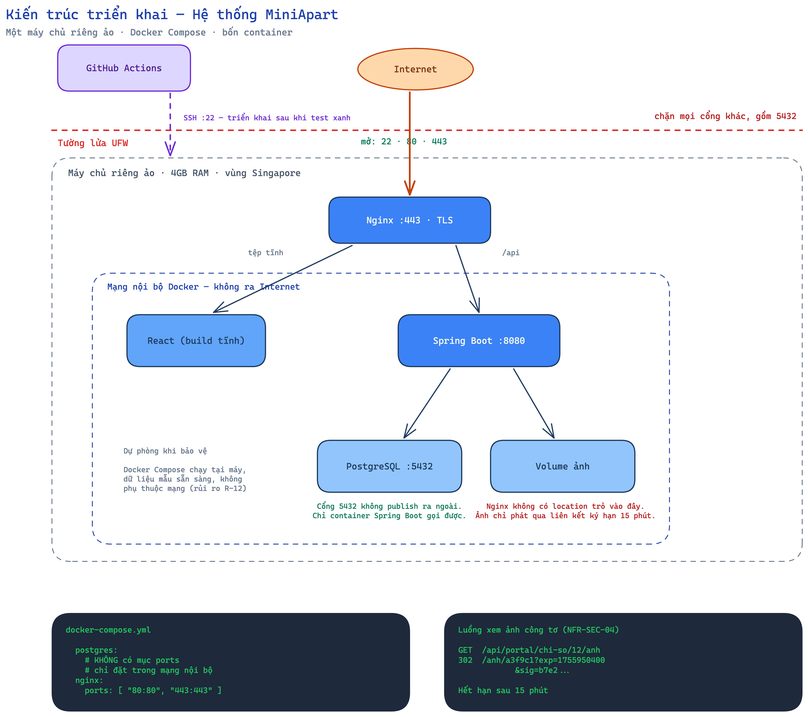

# CHƯƠNG 4. CÔNG NGHỆ SỬ DỤNG

> **Trạng thái:** viết được gần trọn vẹn ở thời điểm hiện tại. Các chỗ đánh dấu `[ĐIỀN]` cần bổ sung sau khi cài đặt xong.

---

## 4.1. Căn cứ lựa chọn

Việc chọn công nghệ cho đồ án này chịu bốn ràng buộc, xếp theo mức chi phối từ cao xuống thấp:

| # | Ràng buộc | Nguồn |
|---|---|---|
| 1 | **Tính đúng của số tiền là yêu cầu cao nhất.** Hệ thống tính tiền điện, nước, tiền phòng cho người thuê thật; sai một đồng cũng là sai | Mục 1.2, BR-01 → BR-19 |
| 2 | **Phải triển khai được và truy cập được qua Internet**, có mã hoá đường truyền | NFR-SEC-01, ràng buộc C-02 sửa đổi theo CR-014 |
| 3 | **Nhóm phải tự bảo vệ được phần mình phụ trách**, nên ưu tiên công nghệ nhóm đã học | Yêu cầu của môn học |
| 4 | **Không ràng buộc từ giảng viên** về ngôn ngữ hay nền tảng | Xác nhận với giảng viên |

Ràng buộc thứ nhất đáng được nói kỹ, vì nó là thứ loại bỏ nhiều phương án nhất. Hệ thống này không giống một ứng dụng quản lý thông thường ở chỗ: **lỗi tính toán không làm chương trình dừng, không sinh thông báo lỗi, và không lộ ra khi kiểm tra bằng mắt.** Một hoá đơn ghi 1.887.999 đồng thay vì 1.888.000 đồng trông vẫn hoàn toàn bình thường. Sai sót loại này chỉ bị phát hiện khi có người đối chiếu tổng thu cuối kỳ, hoặc khi người thuê khiếu nại — tức là muộn.

Do đó tiêu chí chọn công nghệ không phải "viết nhanh nhất" mà là **"khó viết sai nhất, và sai thì máy phát hiện được"**.

## 4.2. Các phương án đã cân nhắc

Phụ lục B của tài liệu phân tích yêu cầu đề xuất ba phương án. Nhóm đánh giá lại như sau:

| Phương án | Ưu điểm | Nhược điểm | Kết luận |
|---|---|---|---|
| **Spring Boot + PostgreSQL + React** | `BigDecimal` là kiểu chuẩn của Java cho số thập phân chính xác; hệ sinh thái kiểm thử trưởng thành; ArchUnit ép được ràng buộc kiến trúc | Cấu hình ban đầu nhiều hơn; hai ngôn ngữ cho hai phía | **Chọn** |
| ASP.NET Core + SQL Server | Kiểu `decimal` sẵn có và chính xác; công cụ tốt | SQL Server bản có phí; triển khai trên Linux phức tạp hơn | Loại vì ràng buộc chi phí |
| Node/NestJS + Next.js | Một ngôn ngữ cho cả hai phía; triển khai đơn giản nhất | **Kiểu `number` của JavaScript là dấu phẩy động nhị phân** — nguồn sai số tiền tệ mà chính Phụ lục B đã cảnh báo | Loại, xem giải thích bên dưới |

**Vì sao loại phương án JavaScript.** Đây không phải định kiến với ngôn ngữ mà là một tính chất kỹ thuật cụ thể. Kiểu `number` của JavaScript tuân theo chuẩn dấu phẩy động nhị phân, nên không biểu diễn chính xác được các phân số thập phân thông dụng. Hệ quả quen thuộc là `0.1 + 0.2` cho ra `0.30000000000000004`. Áp vào bài toán này, một phép nhân đơn giá với số lượng có thể ra `203000.00000000003`, và sai số tích luỹ qua nhiều dòng chi tiết sẽ làm lệch tổng hoá đơn.

Vấn đề **có cách khắc phục** — dùng thư viện số thập phân chuyên dụng và tuyệt đối không để số tiền đi qua kiểu `number` gốc. Nhưng cách khắc phục đó phụ thuộc vào kỷ luật của người viết mã ở **mọi dòng**, mà chỉ cần một chỗ lỡ tay là sai âm thầm. Trong khi đó Java có `BigDecimal` là kiểu chuẩn của ngôn ngữ, và có ArchUnit để **ép bằng máy** rằng không lớp nào trong gói tính tiền được khai báo trường kiểu `double` hay `float`.

Nói cách khác: cả hai phương án đều làm đúng được, nhưng một phương án **để cho máy canh giúp**, còn phương án kia **bắt con người tự nhớ**. Với một nhóm sinh viên làm đồ án trong thời gian có hạn, đây là khác biệt quyết định.

## 4.3. Ngăn xếp công nghệ đã chọn

| Tầng | Công nghệ | Phiên bản | Vai trò |
|---|---|---|---|
| Ngôn ngữ backend | Java | `[ĐIỀN]` | Ngôn ngữ chính phía máy chủ |
| Khung ứng dụng | Spring Boot | `[ĐIỀN]` | Web, tiêm phụ thuộc, phân quyền |
| Truy cập dữ liệu | Spring Data JPA | `[ĐIỀN]` | Ánh xạ đối tượng sang quan hệ |
| Cơ sở dữ liệu | PostgreSQL | `[ĐIỀN]` | Lưu trữ, kiểu `NUMERIC` cho tiền tệ |
| Di trú lược đồ | Flyway | `[ĐIỀN]` | Quản lý thay đổi cấu trúc bảng có phiên bản |
| Giao diện | React | `[ĐIỀN]` | Ứng dụng một trang |
| Kiểm thử đơn vị | JUnit 5 | `[ĐIỀN]` | Kiểm thử các quy tắc nghiệp vụ |
| Kiểm thử theo tính chất | jqwik | `[ĐIỀN]` | Sinh dữ liệu ngẫu nhiên phá các bất biến |
| Kiểm thử tích hợp | Testcontainers | `[ĐIỀN]` | Chạy PostgreSQL thật trong kiểm thử |
| Ép ràng buộc kiến trúc | ArchUnit | `[ĐIỀN]` | Cấm `double`/`float`, cấm phụ thuộc sai chiều |
| Đóng gói | Docker, Docker Compose | `[ĐIỀN]` | Đóng gói và chạy đồng nhất |
| Máy chủ web | Nginx | `[ĐIỀN]` | Proxy ngược, kết thúc TLS |
| Tự động hoá | GitHub Actions | — | Chạy kiểm thử rồi mới triển khai |

## 4.4. Bốn quyết định kỹ thuật đáng giải thích

### 4.4.1. Số tiền dùng `BigDecimal` và `NUMERIC`, tuyệt đối không dùng `double`

Đã trình bày lý do ở mục 4.2. Điều bổ sung ở đây là **cách nhóm bảo đảm quy ước này được tuân thủ**, thay vì chỉ ghi vào tài liệu rồi hy vọng.

Nhóm viết một luật ArchUnit chạy cùng bộ kiểm thử. Luật quét toàn bộ gói `billing` và làm gãy quá trình build nếu tìm thấy bất kỳ trường nào khai báo kiểu `double` hoặc `float`:

```java
noFields().that().haveRawType(double.class).or().haveRawType(float.class)
    .should().beDeclaredInClassesThat().resideInAPackage("..billing..");
```

Ý nghĩa của cách làm này: quy ước **không còn phụ thuộc vào việc ai đó nhớ hay quên**. Người mới vào nhóm, hoặc chính thành viên cũ lúc mệt, viết sai là biết ngay ở lần chạy kiểm thử kế tiếp, chứ không phải sau khi phát hành hoá đơn cho người thuê.

### 4.4.2. Tách phần tính tiền thành các lớp thuần

Gói `billing.calc` chứa toàn bộ cài đặt của BR-01 đến BR-19 và có một ràng buộc riêng: **không được phụ thuộc vào Spring, vào JPA, hay vào cơ sở dữ liệu.** Nó nhận dữ liệu vào qua tham số, trả kết quả ra, không đọc ghi gì cả.

Ràng buộc này cũng được ép bằng ArchUnit:

```java
noClasses().that().resideInAPackage("..billing.calc..")
    .should().dependOnClassesThat()
    .resideInAnyPackage("org.springframework..", "jakarta.persistence..");
```

**Lợi ích thực tế:** kiểm thử cho gói này không cần khởi động Spring, không cần dựng cơ sở dữ liệu, nên chạy trong mili giây. Nhờ đó nhóm viết được hàng trăm ca kiểm thử cho phần tính tiền mà tổng thời gian chạy vẫn dưới vài giây — điều không thể làm nếu mỗi ca phải dựng lại cơ sở dữ liệu.

Đây là lý do kỹ thuật đứng sau chiến lược kiểm thử ba tầng trình bày ở Chương 6.

### 4.4.3. Mọi thay đổi cấu trúc bảng đi qua Flyway

Nhóm không dùng cơ chế tự sinh lược đồ từ thực thể. Mỗi thay đổi cấu trúc là một tệp SQL đánh số tăng dần, và **tệp đã chạy thì không được sửa** — Flyway lưu mã băm của từng tệp và từ chối khởi động nếu phát hiện tệp cũ bị thay đổi.

Lý do: cơ chế tự sinh lược đồ tiện khi mới bắt đầu nhưng **không diễn tả được việc chuyển đổi dữ liệu đã có**. Khi lô phiếu thay đổi số 01 bổ sung bảng `NHAN_KHAU_KY` và các trường mới, câu hỏi không chỉ là "cấu trúc mới trông thế nào" mà còn là "dữ liệu đang có chuyển sang cấu trúc mới ra sao". Chỉ tệp di trú viết tay mới trả lời được câu đó.

### 4.4.4. Ảnh không bao giờ phục vụ trực tiếp

Ảnh giấy tờ tuỳ thân và ảnh công tơ lưu trên một khối lưu trữ gắn với máy chủ, nhưng **Nginx không có cấu hình nào trỏ tới thư mục đó**. Muốn xem ảnh, phía giao diện phải gọi API, được kiểm tra quyền, rồi mới nhận về một liên kết đã ký có hạn 15 phút.

Cách làm này đáp ứng NFR-SEC-04, và là hệ quả trực tiếp của phiếu CR-013 trong lô thay đổi số 01 — phiếu đó chỉ ra rằng việc lưu sẵn một địa chỉ URL trong cơ sở dữ liệu đi ngược lại yêu cầu bảo mật, vì URL cố định thì không có hạn dùng.

## 4.5. Sơ đồ kiến trúc triển khai



Toàn hệ thống chạy trên một máy chủ riêng ảo, gồm bốn container do Docker Compose điều phối. Điểm cần chú ý trên sơ đồ là **ranh giới bảo mật**:

- Tường lửa chỉ mở ba cổng: 22 cho quản trị, 80 và 443 cho người dùng
- **PostgreSQL không publish cổng ra ngoài Docker** — chỉ container ứng dụng gọi được. Điều này được bảo đảm ở mức cấu hình: mục `postgres` trong `docker-compose.yml` không có khoá `ports`
- Khối lưu trữ ảnh nằm ngoài mọi đường dẫn mà Nginx phục vụ

## 4.6. Phân rã module

Sơ đồ phân rã module đã trình bày ở **Hình 3.21, mục 3.9.2** — đó là một quyết định thiết kế nên thuộc Chương 3. Mục này chỉ nói phần liên quan tới công nghệ.

Backend chia theo **module nghiệp vụ**, không chia theo loại kỹ thuật. Nghĩa là không có gói `controllers`, `services`, `repositories` gom chung toàn hệ thống; thay vào đó mỗi module nghiệp vụ tự chứa đủ các lớp của mình.

Mỗi module ứng một tiền tố mã yêu cầu chức năng, giúp truy vết hai chiều theo đúng nguyên tắc ở mục 2.6.4: từ một gói mã nguồn tìm ngược ra được nhóm yêu cầu sinh ra nó, và ngược lại.

---

## Ghi chú cho người viết chương này

Những mục dưới đây **chỉ điền được sau khi cài đặt xong**, đừng viết trước:

- Toàn bộ cột "Phiên bản" ở bảng 4.3 — ghi phiên bản **thực tế đã dùng**, lấy từ tệp cấu hình phụ thuộc, không ghi phiên bản mới nhất trên mạng
- Nếu trong quá trình làm có đổi công nghệ nào so với bảng trên, **phải sửa lại chương này cho khớp và ghi lý do đổi** — báo cáo nói một đằng mã nguồn làm một nẻo là lỗi bị trừ điểm nặng
- Cân nhắc bổ sung mục 4.7 "Những khó khăn kỹ thuật gặp phải và cách xử lý" nếu có tình huống đáng kể. Mục này thường được đánh giá cao vì cho thấy quá trình làm thật, nhưng **chỉ viết nếu có chuyện thật**, đừng bịa
